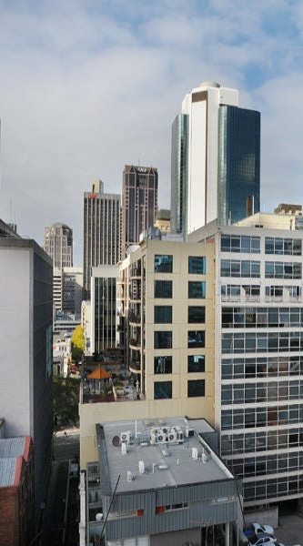

# DownUnderCTF 2021 - Apartment Views

## 题目简述

题目提供一张从公寓高处拍摄的城市景观，要求找出附近用于 dead drop 的巷道名称。画面中同时出现多栋可识别建筑，适合用地标之间的方位关系反推拍摄楼宇，而不是只识别城市。



## 解题过程

画面中央较远建筑顶部能辨认出 `ANZ` 标志。检索澳大利亚的 ANZ 高层建筑后，可把它对应到 Melbourne 的 100 Queen Street，由此确定城市和第一个锚点。

右侧最醒目的高楼具有两面蓝色玻璃和一条圆弧状白色转角，地图与街景可将其对应到 200 Queen Street。利用这两栋建筑在照片中的左右顺序和遮挡关系，可以画出拍摄方向；照片应来自 200 Queen Street 东北侧约一到两个街区的位置。

继续对照卫星图和街景：画面左下的小街是 Hardware Street，邻近砖楼可对应 112 Hardware Street。结合楼层高度与视线，拍摄点落在 Hardware Street 尽头、约 318 或 320 Little Lonsdale Street 的公寓。画面中还可用 Westpac 红色标志和 333 Collins Street 的圆顶作交叉验证。

题目问的不是公寓所在主路，而是其后方的 alleyway。查看该楼背后的细街，名称为：

```text
McLean Alley
```

按题目格式得到：

```text
DUCTF{mclean_alley}
```

## 方法总结

城市景观定位的可靠方法是至少使用两个地标建立方向约束，再用街区数量、遮挡关系和近景建筑确认拍摄点。识别出城市只是中间结果，还要重新阅读问题中的 `alleyway` 等实体类型提示，区分公寓地址、画面中的街道和最终要求提交的邻近巷道。
