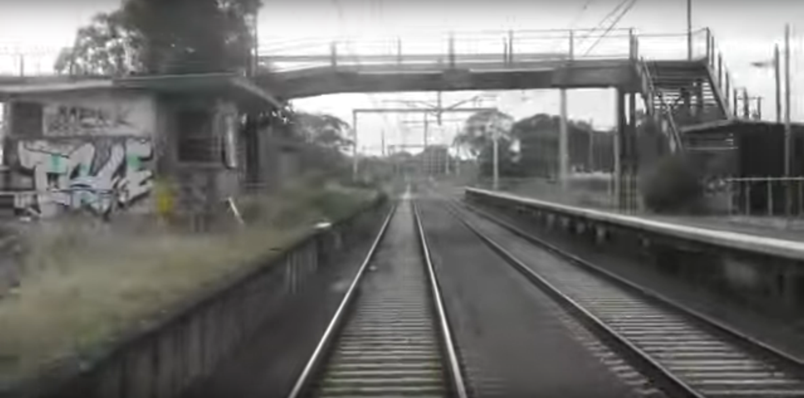

# DownUnderCTF 2021 - (back) On the rails

## 题目简述

题目给出一张从行驶列车上拍摄的低清、运动模糊车站照片，要求识别站名。画面显示被涂鸦的废弃站房、杂草侵占的平台、跨线人行天桥以及仍在使用的电气化复线；前序剧情还把嫌疑人的活动范围收窄到 Victoria。



## 解题过程

先把可复用的视觉特征转成搜索词，例如 `abandoned railway station Victoria overgrown footbridge`。不要只搜“澳大利亚废弃车站”，否则候选过多；Victoria 是来自前序题的关键区域约束。

比较搜索结果中的站房位置、平台布局、架空电线、天桥楼梯方向和植被状态，可以匹配到 Dandenong 一带的旧 General Motors railway station。该站位于仍有列车经过的走廊上，但客运设施已废弃，这与题图“从列车经过时拍到荒废站台”的组合特征一致。站点的历史名称与位置也可在 [General Motors railway station 资料页](https://en.wikipedia.org/wiki/General_Motors_railway_station) 中交叉确认。

官方配置接受若干等价名称，最简提交为：

```text
DUCTF{general_motors}
```

以下形式同样有效：

```text
DUCTF{general_motors_station}
DUCTF{general_motors_railway_station}
DUCTF{general_motors_train_station}
```

## 方法总结

低质量地理图片仍可从“设施组合”中提取强特征：废弃平台与活跃电气化线路并存、站房和天桥的相对方向，比单个模糊标牌更稳定。系列 OSINT 题还应继承已验证的地区信息，用州级约束显著缩小搜索空间，再以多个结构细节完成确认。
