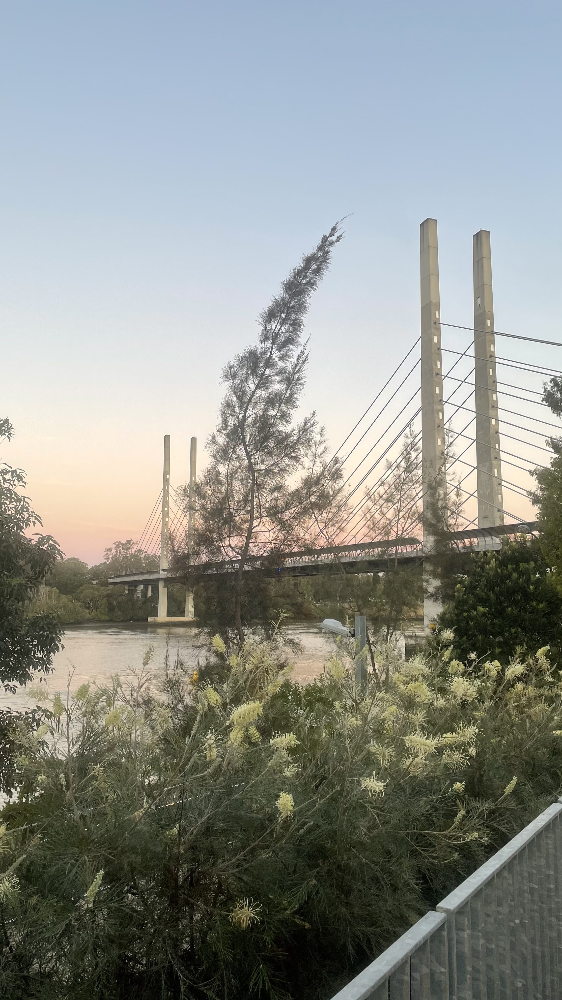

# DownUnderCTF 2021 - Get over it!

## 题目简述

题目给出一张澳大利亚桥梁照片，要求提交桥名及主跨长度。图中桥面由多组近似平行的斜拉索支撑，主塔为成对的高矩形混凝土柱，因此应先按斜拉桥而非传统悬索桥检索。



## 解题过程

反向图片搜索因题图取景和裁切未直接命中，但视觉相似结果可以先确认结构类别。搜索澳大利亚斜拉桥并逐项对照，题图中的两组分叉主塔、竖琴式索面、桥面雨棚以及河岸环境都与 Brisbane River 上连接 Dutton Park 和 University of Queensland St Lucia 校区的 Eleanor Schonell Bridge 一致。

桥名确认后再独立核对工程参数。桥梁设计顾问 SYSTRA IBT 的[项目技术页](https://www.systra.com/ibt/project/eleanor-schonell-bridge-brisbane-australia/)把主跨列为 183 m；建筑设计方 Denton Corker Marshall 的[项目页](https://dentoncorkermarshall.com/projects/eleanor-schonell-bridge/)则写为 185 m。差异来自资料采用的测量与取整口径，赛事配置因此同时接受两者。

以设计顾问给出的 183 m 写法，可提交：

```text
DUCTF{Eleanor_Schonell_Bridge-183m}
```

省略 `_Bridge`，或把长度写成 `185m`，也在官方接受列表中。

## 方法总结

桥梁定位应先从结构类型、塔柱形状、拉索排列和附属设施建立候选集，再用环境与局部细节逐项排除。名称和工程参数应分开验证；当权威资料对跨度定义或取整存在差异时，正文要说明口径，并以题目判定配置确认可接受格式，而不是无解释地列出多个答案。
