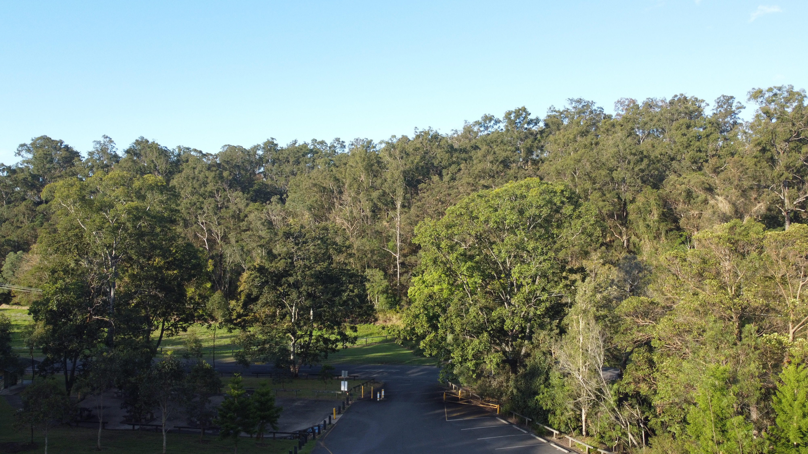

# DownUnderCTF 2022 Bird's eye view! Writeup

## 题目简述

题目给出一张无人机俯拍照片，要求找出照片拍摄的野餐区域。题面特意把 `EXAMINE` 大写，是对 EXIF 元数据的提示；仅凭画面中的树林和停车场很难唯一定位。

原图既包含 GPS 元数据，也能用于把地图上的道路、停车位和林地布局与现场对应，因此作为关键视觉证据保留：



## 解题过程

先读取 JPEG 的 EXIF GPS 字段：

```sh
exiftool -GPSLatitude -GPSLongitude -GPSPosition view.jpg
```

原始度分秒数据换算后为：

```text
Latitude  = -27.46852433
Longitude = 152.96947114
```

坐标首先把范围缩小到澳大利亚布里斯班的 Mount Coot-tha 一带。题目问的是具体“area”，不能只提交较大的山地区域名称。继续放大地图并比较坐标附近的停车场入口、弯曲道路和林地空地，落点对应 `Hoop Pine Picnic Area`。

该名称也与照片内容相符：画面下方是野餐区的道路与停车位，周围为 Mount Coot-tha 林地。规范化为无空格形式后，答案为：

```text
DUCTF{HoopPinePicnicArea}
```

## 方法总结

图像 OSINT 应先做成本最低的元数据检查，再进入纯视觉定位。GPS 坐标通常只能给出近似落点，最终仍要根据题目要求选择正确粒度的地名，并用道路、停车区和地形布局交叉验证，避免把 `Mount Coot-tha` 这种大范围名称误当作具体野餐区。
