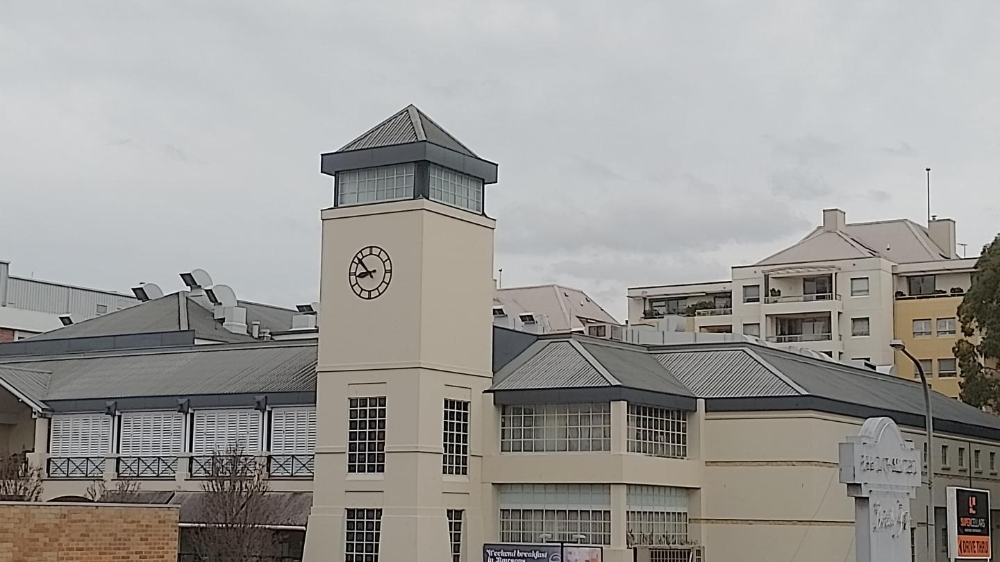

# DownUnderCTF 2022 Pre-Kebab Competition Writeup

## 题目简述

题目给出一张城市建筑照片，要求回答照片从哪座建筑拍摄，答案为不带空格的建筑名。图片没有足以直接作答的元数据，主要依靠招牌、道路名称和建筑外观做视觉地理定位。

原图中的文字很小，且钟楼、商店位置和街景布局共同参与验证，不能只转写成几行文字后丢弃，因此保留为视觉证据：



## 解题过程

放大照片后可以提取三组互相补强的线索：

- 右下角是带 `Drive Thru` 字样的酒类商店招牌，品牌可辨认为 `SUPER CELLARS`；
- 画面底部被截断的标牌可读出 `Rawson`，指向 Rawson Street；
- 建筑右侧较淡的招牌能够辨出 `EPPING HOTEL`，但应继续用前两条线索验证，避免把模糊文字看错。

搜索 `Super Cellars Rawson Street` 会定位到 Epping, NSW。该场所的 [Epping Hotel 官方 Bottle Shop 页面](https://www.eppinghotel.com.au/bottle-shop/) 说明其 Super Cellars drive-through 入口正位于 Rawson Street，并给出 Epping Hotel 的场所信息。再用街景比较照片中的钟楼、酒铺与周边建筑相对位置，三者一致。

因此拍摄建筑为 `Epping Hotel`，提交：

```text
DUCTF{EppingHotel}
```

## 方法总结

视觉地理定位应把低清文字拆成多条独立线索，再通过联合搜索降低歧义。本题若只搜索 `cellars` 会得到大量结果；加入 `Super Cellars`、`Rawson Street` 后才能快速收敛。最后还要用钟楼和店铺布局做街景复核，不能把搜索结果本身当作最终证明。
