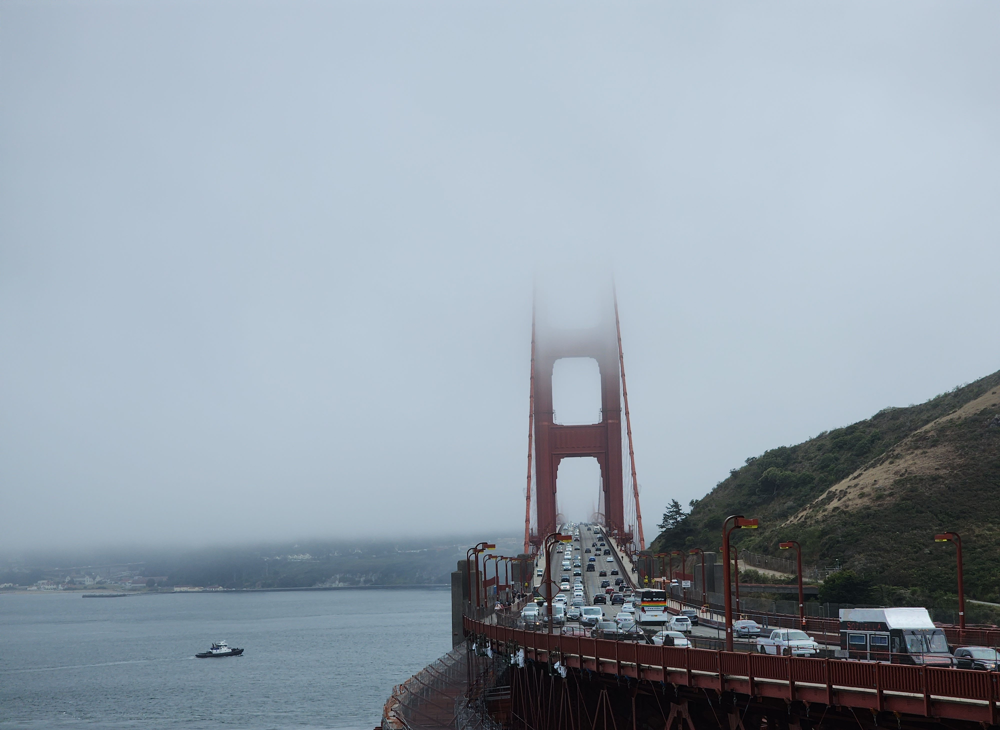

# DownUnderCTF 2023 Bridget's Back Writeup

## 题目简述

题目给出一张从道路正面拍摄的红色悬索桥照片，要求确定拍摄点，而不是只回答桥名。图中桥塔、雾和周围地形都具有明确的地理定位价值，因此保留原图。



## 解题过程

红色桥身、矩形桥塔开口和经常出现的低云首先指向旧金山金门大桥。照片几乎沿车道轴线向桥上望去，右侧紧邻绿色山坡，说明拍摄者位于大桥北端的马林县一侧，并朝旧金山方向拍摄。

继续比较北端几个常见观景点：Battery Spencer 位于桥西侧，通常得到明显的侧视构图；本图则从桥东侧、接近道路高度的位置拍摄，车道弧线和桥塔基本重合。这些特征与 H. Dana Bower Rest Area 的 Vista Point 相符。

题目判定接受该休息区或 North Vista Point 的常见写法。按要求提交：

```text
DUCTF{H_Dana_Bowers_Rest_Area}
```

## 方法总结

地标识别只解决了“拍的是什么”，题目实际问“从哪里拍”。定位时要继续利用视角、道路方向、山坡所在侧和桥塔重合关系，在候选观景点之间做几何排除，不能看到金门大桥后就停止。
