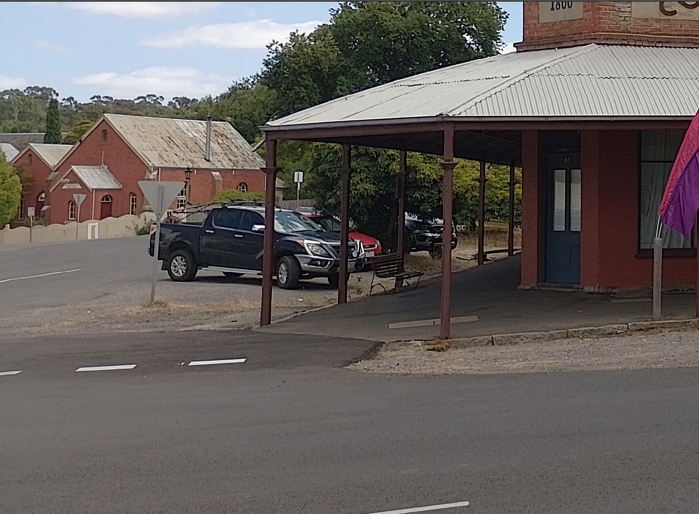

# DownUnderCTF 2023 Comeacroppa Writeup

## 题目简述

题目要求判断照片所在的 suburb。画面被刻意裁切，只保留澳大利亚小镇街景、红砖历史建筑和建筑顶部的一小段题字；这些局部特征仍足以缩小地点。



## 解题过程

先观察环境特征：道路样式、车辆及牌照外观指向澳大利亚维多利亚州，街区则保留了淘金时代常见的低层砖石建筑。右上角建筑招牌虽然被裁掉大半，但年份可以还原为 `1866`；题名 `Comeacroppa` 也提示要关注被 crop 掉的内容。

以“Victoria heritage building 1866”等组合检索历史建筑，再用红砖外墙、深色廊柱、波纹铁皮屋顶、门牌 `65` 和街对面的教堂式建筑逐项比对，可以把地点锁定到历史小镇 Maldon。反向图片检索时只框选右上方建筑，也会得到相同地点。

题目要求 suburb 名称，故提交：

```text
DUCTF{maldon}
```

## 方法总结

裁图没有消除所有定位信息。年代、建筑材料、门牌、道路与周边建筑组合起来比单一 OCR 文本更可靠。先判断州或区域，再用年代和建筑立面缩小候选，最后以街景中的相对位置交叉验证。
