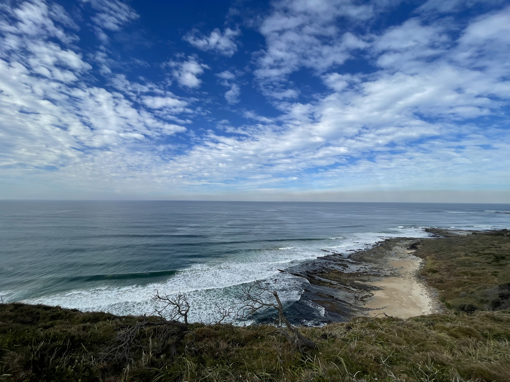

# DownUnderCTF 2023 Excellent Vista Writeup

## 题目简述

题面把 `EXAMINE` 特意大写，并提示“stop, lookout”，指向图片元数据和具体观景点。照片本身展示了岩石海岸、沙滩和高处视角，具有视觉定位价值，因此与 GPS 证据一起保留。



## 解题过程

读取 JPEG 的 EXIF GPS 字段可以看到：

```text
GPS Latitude : 29 deg 30 min 34.33 sec S
GPS Longitude: 153 deg 21 min 34.46 sec E
```

换算后约为 `-29.509536, 153.359572`。例如可直接使用：

```bash
exiftool -GPSLatitude -GPSLongitude -n durrangan-coast-view.jpg
```

坐标落在澳大利亚新南威尔士州 Yuraygir National Park 海岸。题面要求的是具体 lookout，而不是国家公园名称；结合坐标和照片中岩棚、狭长沙滩的朝向，可确定拍摄点为 Durrangan Lookout。

```text
DUCTF{Durrangan_Lookout}
```

## 方法总结

本题的主证据直接存在 EXIF 中。获得坐标后仍要按题目措辞选择正确粒度：国家公园只是上级区域，最终答案是坐标所在的观景点。归档时保留原始 JPEG 很重要，因为重新导出图片可能会清除 GPS 元数据。
