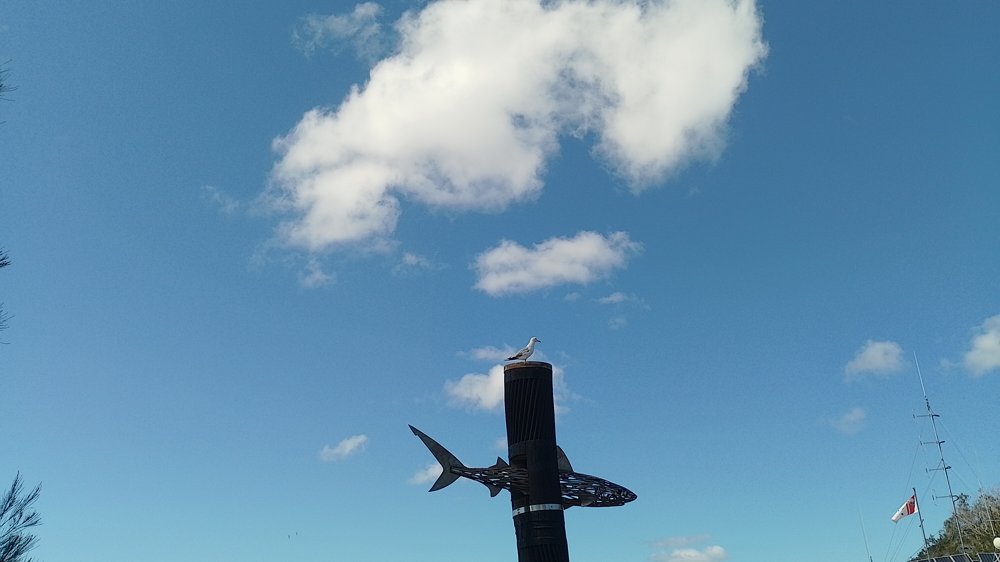

# DownUnderCTF 2023 Shipwrecked Writeup

## 题目简述

题目要求判断照片拍摄地的 suburb。画面主体是海鸥停在黑色立柱上，立柱横向连接一条金属鲨鱼；右下角还能看到一面红白旗帜和船用天线。这些组合是定位海上救援站的关键视觉信息。



## 解题过程

先放大右下角旗帜，其配色和标志对应 Marine Rescue NSW。鲨鱼造型、海鸥和无线电天线也说明拍摄点靠近该组织的沿海基地，而不是普通公园雕塑。

列出 Marine Rescue NSW 各基地后，逐一比较公开照片和街景。Camden Haven 基地的入口附近存在同样的黑色立柱和横向鲨鱼骨架雕塑；较新的用户照片还能看到鲨鱼穿过立柱的角度，与题图完全一致。该基地的地址位于 Laurieton。

题目要求全小写 suburb：

```text
DUCTF{laurieton}
```

## 方法总结

图片中最醒目的海鸥不是唯一线索，边缘处的组织旗帜才是高区分度特征。先识别机构，再在有限的基地列表中做地标比对，比直接搜索“shark sculpture seagull”更稳定；最后还要把基地名称映射到题目要求的 suburb 粒度。
