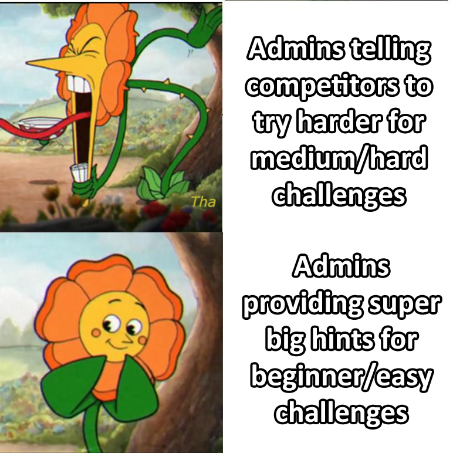
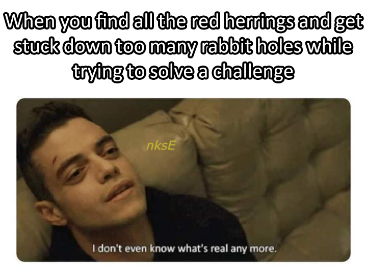
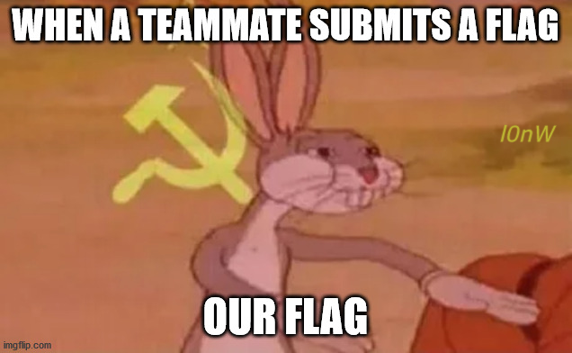
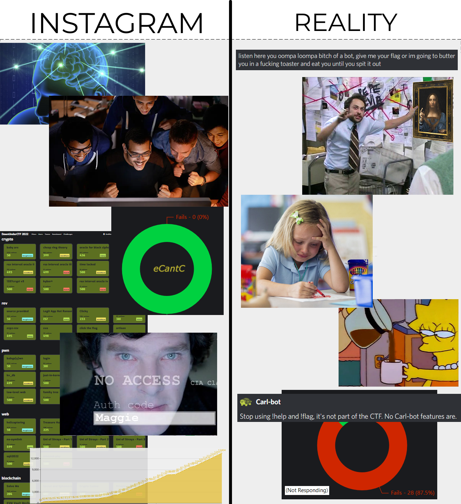
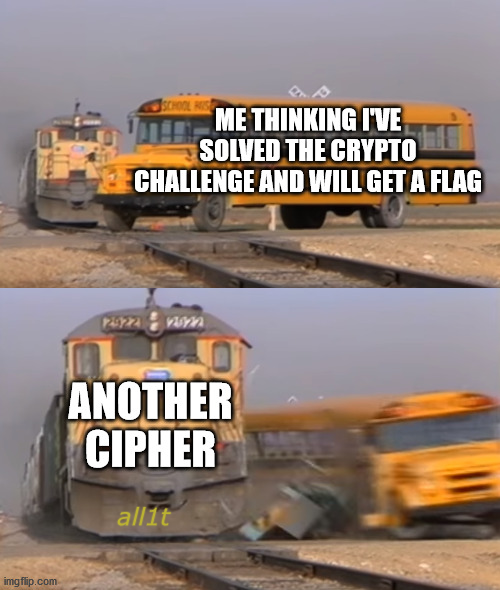
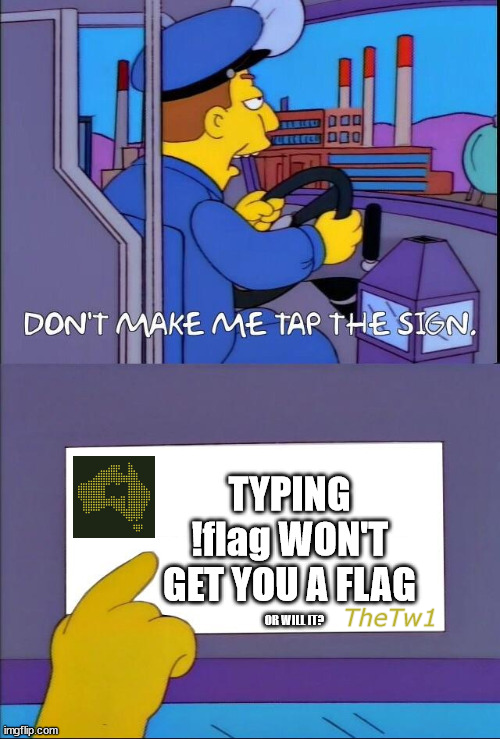
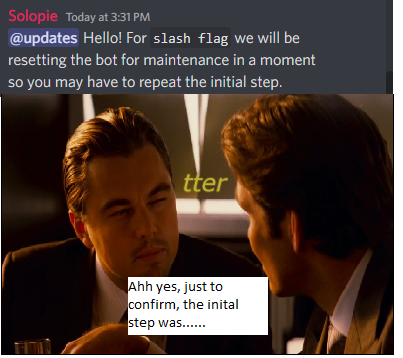
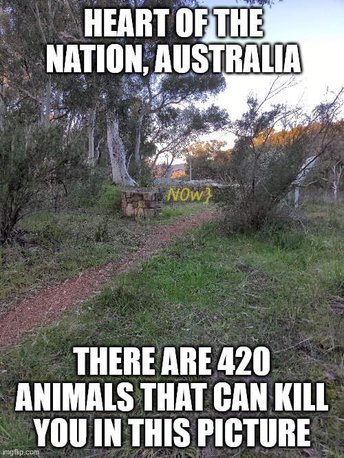

# DownUnderCTF 2023 X Writeup

## 题目简述

题面引导选手查看 DownUnderCTF 在 X（原 Twitter）发布的 meme 图片。每张图中都藏有一段采用 DUCTF 绿色或黄色标出的文字；平台展示顺序不可靠，需要收集全部片段并重排成通顺句子。

## 解题过程

仓库保留了十张原始帖子配图，因此无需依赖赛事结束后可能失效的社交媒体页面。逐张观察可以读出以下片段。

第一张图在 meme 上标出了 flag 前缀 `DUCTF{`：


接下来两张分别给出 `Tha` 和 `nksE`，拼成 `ThanksE`：





第四张给出 `l0nW`，与前后的片段组成 `El0nWe`：



第五、六张分别给出 `eCantC` 和 `all1t`，合并为 `eCantCall1t`：





第七、八张给出 `TheTw1` 和 `tter`，组成 `TheTw1tter`：





最后两张分别给出 `Fl4g` 和 `N0w}`：




按语义重排后得到完整句子 `Thanks El0n, We Cant Call 1t The Tw1tter Fl4g N0w`。删除空格和标点后，flag 为：

```text
DUCTF{ThanksEl0nWeCantCall1tTheTw1tterFl4gN0w}
```

## 方法总结

本题的外部平台只承担线索分发功能，真正证据是图片中的彩色片段。归档时保留承载片段的原图并写明每张图可读出的文字，既保留视觉上下文，也使正文在不访问 X 的情况下能够独立复现重排过程。
