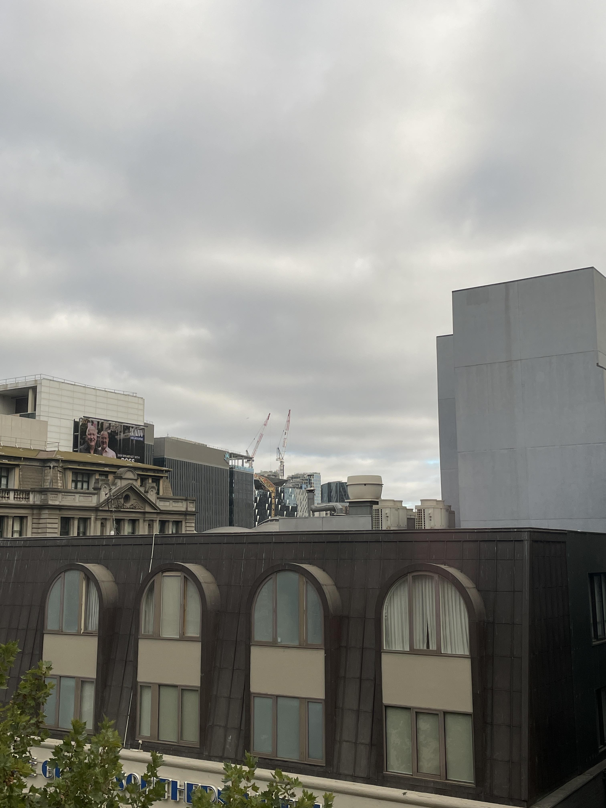

# cityviews

## 题目简述

照片拍向墨尔本市区，题目要求判断相机所在建筑。决定性线索是左侧广告牌的 `3AW Melbourne`、对面楼体残缺可读的 `...G SOUTHERN H...`，以及两座建筑相对的几何关系，归入 OSINT。

## 解题过程



先读出广告牌的 `3AW Melbourne`，把城市范围收窄到墨尔本。对面建筑的残字可补为 `Great Southern Hotel`；在街景中核对其立面、广告牌位置和周边高楼，确认照片所见确为该酒店方向。

题目问的仍是相机位置而非画中酒店。沿 Great Southern Hotel 正对面的建筑逐一比较，原先的 Holiday Inn 位置现标为 Hotel Indigo Melbourne。其屋顶高度、窗口/屋檐前景和面对 Great Southern Hotel 的方向与照片一致，答案为：

```
DUCTF{hotel_indigo_melbourne}
```

## 方法总结

城市定位应先用可检索文本建立候选地标，再用相对位置反推相机。广告牌、店名残字能够快速确定城市，但容易把“看见的建筑”误当“拍摄的建筑”；最后必须从对街关系、朝向和高度确认观察点。该图包含两段关键文字和空间关系，因此保留原始视觉证据。
