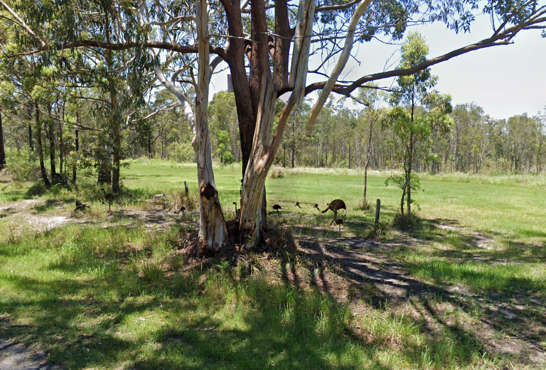

# They're Making Decoys

## 题目简述

照片显示桉树林草地中的多只金属鸸鹋雕塑，题目要求给出地点经纬度并四舍五入到四位小数。图像、题干中的 Clarence、Emu sightings 与 “broom heads” 共同指向新南威尔士州 Brooms Head 周边的公开鸸鹋目击地图，归入 OSINT。

## 解题过程



先以 `Clarence` 和 `Emu sightings` 搜索公开资料，可找到 Clarence 地区的 Coastal Emu Sightings Map。沿目击点密集区域缩小范围时会出现 Brooms Head Road；这与题干 “broom heads” 形成文字验证，而不是巧合的地名匹配。

再以图中金属鸸鹋雕塑与 Brooms Head 交叉检索/查看街景，可在 Brooms Head Road、接近 Tailem Drive 的一处草地找到相同的树木、围栏和雕塑排列。该位置坐标按四位小数取整为：

```text
-29.5505,153.2776
```

所以 flag 为：

```
DUCTF{-29.5505,153.2776}
```

## 方法总结

视觉地理题可以同时使用题干语义和图像实体：行政区/物种信息先缩小公开数据源，雕塑、植被和道路再做最终定位。不要只凭“看起来像澳洲”提交坐标；至少应有公开目击地图、地名双关和街景实体三条相互支持的证据。原图中的雕塑排列是最后一跳的关键，因此保留。
