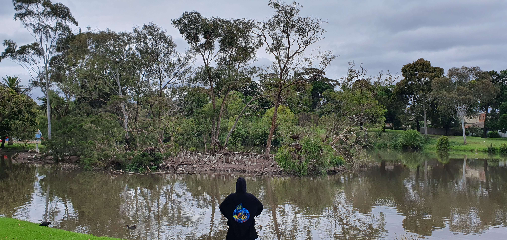

# Look at all those chickens!

## 题目简述

题目图片拍到一座被大量澳洲白鹮占据的小岛；白鹮常被称为“bin chicken”。题目要找的不是鸟当前栖息的小岛，而是它们先前被关押地点的名称。官方提示依次给出“识别鸡的种类”“对图片配合关键词反向搜索”“在小岛附近找关押处”，所以需要将图像识别结果与地图上的邻近地点关联。



## 解题过程

先从图中密集聚集的白鹮得到俗称 `bin chicken`。以图片作反向图片搜索，并补充 `bin chicken island`，会得到位于墨尔本 Coburg 的相关结果；这一步定位的是鸟现在活动的岛，而不是答案。

随后围绕该岛查看地图及道路两侧的地点。题面说鸟“在图片附近被关押”，而岛对面紧邻的历史拘禁设施是 **Pentridge Prison**。这同时满足“附近”“关押”和两词答案三个约束，故提交：

```text
DUCTF{Pentridge_Prison}
```

图片保留为本题不可替代的视觉起点：鸟种、岛屿形态与反向搜索均依赖其内容，不能可靠地由一段纯文本替代。

## 方法总结

- 核心技巧：由物种俗称构造更有区分度的反向搜索关键词，再把图像定位与题面要求的历史语义分开验证。
- 识别信号：OSINT 题强调“不是现在的位置”“附近”时，首个定位点通常只是 pivot；答案往往是周边与题面动作语义相符的地点。
- 复用要点：得到地名后应回读题目约束。这里不能提交 Coburg 小岛，而要在其周边寻找与“captivity”相对应的 Pentridge Prison。
