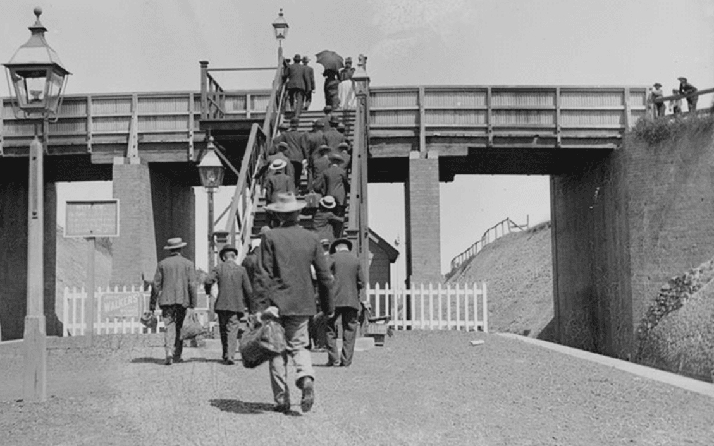

# Love GranniE

## 题目简述

题目给出一张黑白旧桥照片，并以“无声电影时代”“过去常去看电影”为线索，要求写出旧电影院建筑名、现址门牌和 suburb。图片本身没有清晰的影院招牌，首先必须通过反向图片搜索建立地理锚点；随后再用“旧电影院”这一语义线索查历史记录。题面特别提醒旧资料可能写错门牌，因此地址需要额外验证。



## 解题过程

对历史桥梁照片进行反向图片搜索，会命中新南威尔士州的 Epping Bridge Project 相关资料，从而确定 suburb 为 **Epping**。桥本身只是定位线索，不是题目要求填写的电影建筑。

结合题面“看电影”和已知 suburb，搜索 `old cinema Epping NSW`。历史影院记录把旧电影场所指向 **The Cambria Hall**（也常被写作 Cambria Hall）。部分旧资料给出 `46 Beecroft Road`，但该门牌对应相邻建筑；将地点与现址资料交叉核对，可确认这座保留在旧影院基础上的建筑实际位于 **47 Beecroft Road, Epping**。

将建筑全名、门牌街道和 suburb 按题目格式拼接：

```text
DUCTF{TheCambriaHall_47BeecroftRoad_Epping}
```

图片保留，因为“先用桥景反向搜索得到 Epping”是从稀疏线索进入历史资料链的必要视觉步骤；其余历史文本信息已经转写在正文中。

## 方法总结

- 核心技巧：先把无文字的历史照片反向搜索为可靠 suburb，再按题面语义搜索当地的历史建筑记录。
- 识别信号：题面同时给出旧照片、活动用途和门牌校正提示时，答案通常需要“视觉定位 → 历史实体 → 当前地址”三次独立确认。
- 复用要点：历史资料的地址不能直接照抄。对相邻门牌、改建项目或新机构地址做地图与现址交叉验证，能避免在最后的格式化提交上失分。
