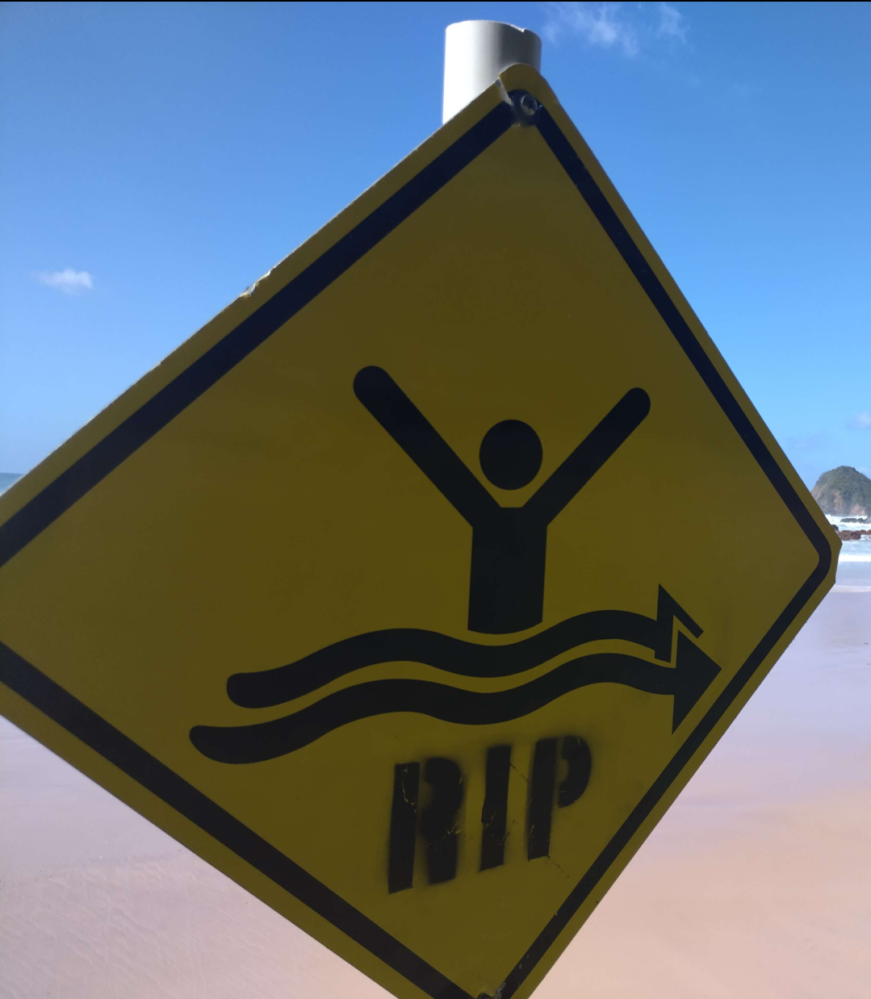

# yippee

## 题目简述

题目给出一张海滩照片，并说明明信片背面画着 waratah（新南威尔士州州花）。照片正面可见 `RIP` 离岸流警示牌、右侧海岬和近岸岩石；这些组合把搜索范围收敛到新南威尔士州有人巡逻的旅游海滩。题目配置要求地点名不含空格。附件元数据中的 Base64 内容和位于百慕大三角的经纬度都是干扰，不参与定位。



## 解题过程

先使用 waratah 将候选区域限定到 NSW。`RIP` 标志说明该处有救生巡逻；再结合海滩右侧明显的海岬和岩石，可为反向图片搜索提供比“澳大利亚海滩”更精确的特征。

裁剪或以海岬区域作反向图片搜索，并加入 `NSW beach` 或 `NSW patrolled beach`，会得到与图中地貌相近的候选。逐一对照海岬轮廓、沙滩与岩石后，匹配 **Flynns Beach**。这也是官方预期的人工筛选路径：反向搜索给出近似结果，再用照片中的多个地貌特征确认，而非相信单个自动标签。

按题目要求去掉空格与撇号后提交：

```text
DUCTF{FlynnsBeach}
```

官方说明末尾展示的带空格写法不符合题面“no spaces”；仓库配置接受的规范化值为 `flynnsbeach`，故以上写法是可提交的形式。

## 方法总结

- 核心技巧：把州花、海滩安全标志和海岬地貌叠加为搜索约束，再以多项视觉特征确认候选地点。
- 识别信号：旅游照片没有文字地标但带有区域性植物、公共标志和独特地形时，应先建立粗粒度区域，再做局部图像匹配。
- 复用要点：元数据可能是有意设置的假线索。将每条线索与照片和题面语义交叉验证；最终还要按 flag 格式规范化空格、撇号和大小写。
