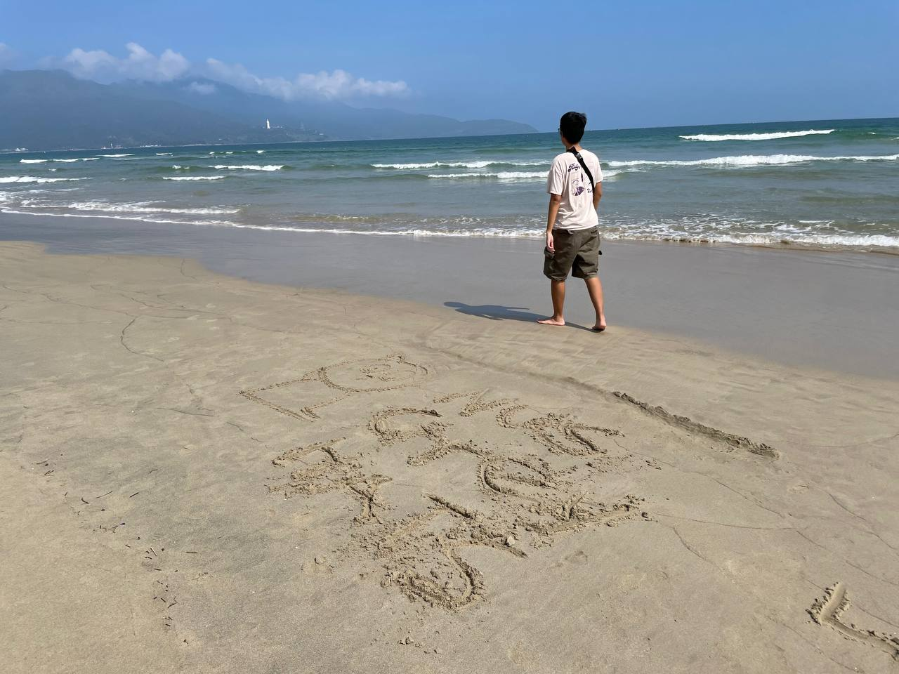

# GreyCTF2024 Cats At The Beach WP

## 题目简述

题目给出一张在越南拍摄的海滩照片，要求定位海滩名称，flag 格式为 `grey{name_of_beach_in_lower_case}`。图片中的海岸线、城市建筑与远处山坡上的白色观音像构成了有效地理线索。

## 解题过程



先观察远处山体上的大型白色观音像。题目提示 `linh unh pagoda`，结合越南岘港地标可修正为山茶半岛灵应寺（Linh Ứng Pagoda）的观音像。该地标位于岘港东北方向，从城市东侧海岸向山茶半岛望去十分醒目。

再比对照片中的视角：画面右侧为城市海岸，远处是山茶半岛，拍摄点位于岘港东侧连续沙滩的北段。与公开街景和海岸照片核对后，位置对应 Phạm Văn Đồng Beach，而不是更南侧的 Mỹ Khê Beach。

按题目格式去掉越南语变音符号、使用小写并以下划线分词：

```text
grey{pham_van_dong}
```

## 方法总结

这类图片定位应先找不可替代的地标，再用海岸方向和城市轮廓确认拍摄点。白色观音像确定山茶半岛，岸线相对方向进一步把范围缩到 Phạm Văn Đồng Beach；保留原图是必要的，因为空间关系本身就是解题证据。
