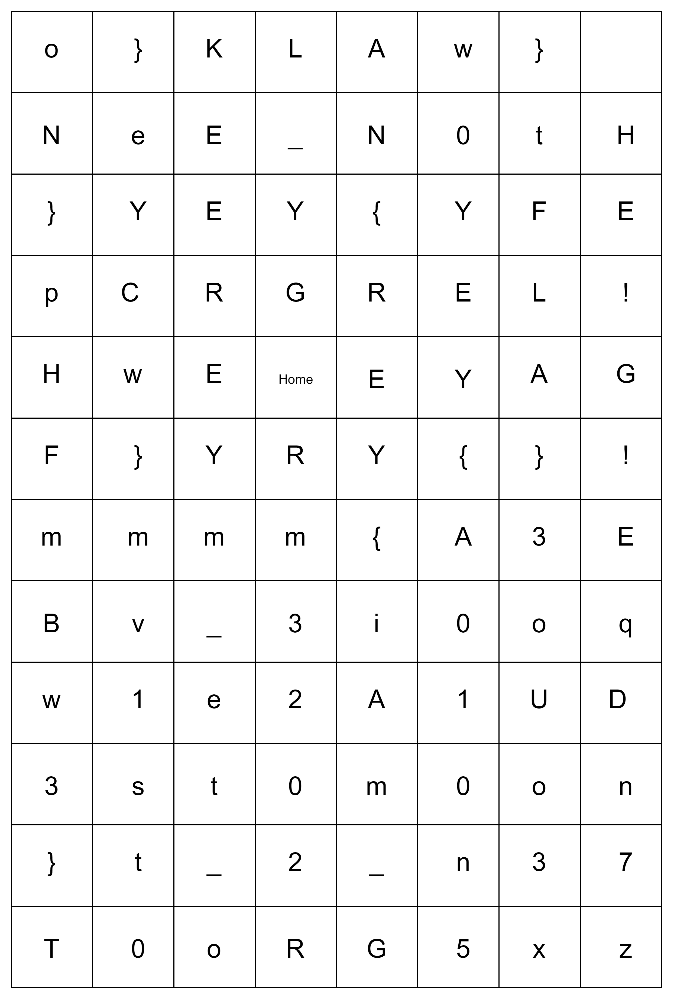

# GreyCTF2024 Grey Divers WP

## 题目简述

题目列出七个《Helldivers 2》战略配备名称，并附上一张以 `Home` 为起点的字母网格。需要查到每个战略配备的方向键序列，再把这些方向当作网格路径，依次读出字符。

## 解题过程



查表得到七组按键：

| 战略配备 | 方向序列 |
| --- | --- |
| Eagle 500 Kg Bomb | U R D D D |
| GL-21 Grenade Launcher | D L U L D |
| MD-I4 Incendiary Mines | D L L D |
| Orbital Gas Strike | R R D R |
| Orbital Airburst Strike | R R R |
| Eagle Rearm | U U L U R |
| Eagle 110MM Rocket Pods | U R U L |

每一行都从图片中央的 `Home` 重新开始，按 `U/D/L/R` 分别向上、下、左、右移动，并记录路径终点或路径所指示的字符。按题目给出的七项顺序拼接，得到完整 flag：

```text
grey{i3mm_e1w3st_2_n3oU10o3E!}
```

大小写是网格结果的一部分，不能统一转成小写。

## 方法总结

本题把外部游戏资料与附件网格组合成两层映射：名称先映射为方向序列，方向再映射为字符。正文已完整保留所需的七组按键，因此复现时无需依赖外链；图片则保留了真正有价值的二维空间关系。
