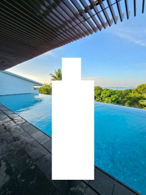

# GreyCTF2024 Poolside Paradise or Criminal Hideout WP

## 题目简述

题目给出一张新加坡酒店泳池照片，要求用 what3words 的三个单词地址作答。图片中的狭长无边泳池、石墙、浓密热带植被和低层露台客房是主要地理识别线索。

## 解题过程



先按建筑类型搜索新加坡带“客房直通泳池”的低层度假酒店。照片不像市中心高层酒店：泳池被绿植包围，客房沿长边展开，背景没有城市天际线。图片比对后可定位到圣淘沙 Amara Sanctuary Resort Sentosa 的 Larkhill Terrace 区域及其长条形无边泳池。

再把泳池中心区域放到 what3words 地图上。三个单词地址的单元格只有约 $3\text{ m}\times3\text{ m}$，同一个泳池会横跨多个格子，所以官方接受了十五组相邻答案。选取其中一个位于泳池范围内的地址：

```text
lonely.jams.pretty
```

按题目格式封装：

```text
grey{lonely.jams.pretty}
```

## 方法总结

地理定位应先用建筑形态缩小到具体场所，再用 what3words 做精确坐标编码。三个单词地址并不是场所名称，而是微小网格坐标；对于大型泳池，多个相邻答案同时正确是合理现象。原图保留了布局和环境关系，具有不可替代的视觉价值。
