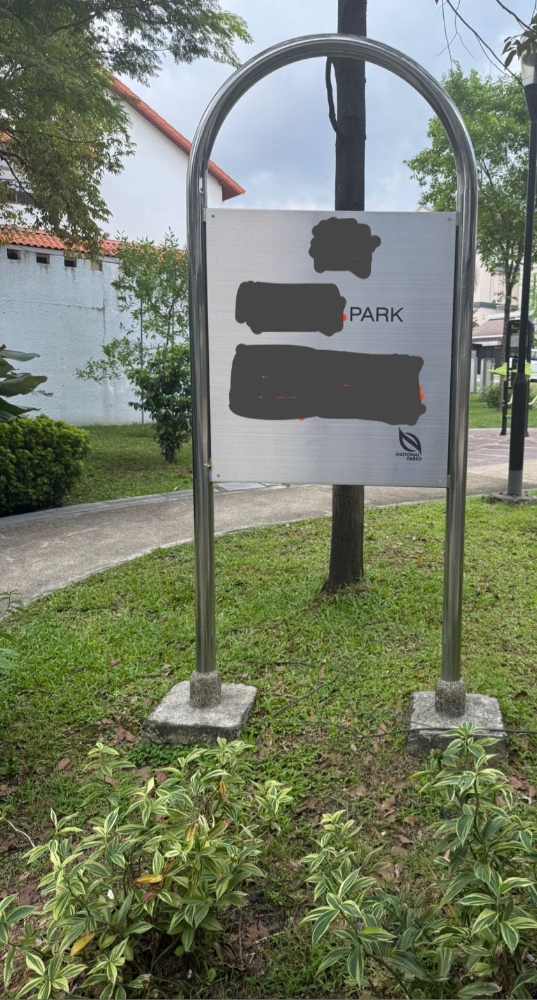

# A Walk In The Park

## 题目简述

题目给出一张被刻意遮住文字的公园告示照片，要求恢复告示内容，并将字母转为小写、换行与空格统一替换为下划线后放入 `grey{...}`。照片本身无法直接读出答案，突破口藏在文件元数据和拍摄者留下的公开活动记录中。



## 解题过程

先查看原图的 EXIF，而不是对被遮挡区域做无依据的图像增强：

```bash
exiftool a_walk_in_the_park.jpg
```

原始附件的 `Artist` 与 `Copyright` 字段均为 `the_real_lim_kx`。官方解答把该字符串写成了 `the_real_lee_kx`，但直接读取附件可确认应以前者为准。用这个用户名追踪公开 Instagram 账号，其 Story 又指向同名 Strava 账号；在运动员编号 `170347344` 的活动中，找到与照片时间相符的 5 月 21 日路线。

接下来沿该公开路线查看街景，重点比对照片里的绿地、步道和告示牌位置。匹配位置位于 Upper Serangoon Road 一带，街景中的告示完整文字为：

```text
INTERIM PARK
UPPER SERANGOON ROAD
```

按题目要求进行规范化：

```text
grey{interim_park_upper_serangoon_road}
```

## 方法总结

这题的关键不是猜测被涂黑的像素，而是建立“附件元数据 → 社交账号 → 运动轨迹 → 街景复核”的证据链。处理此类 OSINT 图片时，应先保留原文件并检查 EXIF；同一用户名跨平台复用常能提供下一跳。最终位置仍需用可见环境特征和街景告示交叉验证，不能仅凭用户名或路线附近的同名地点下结论。
