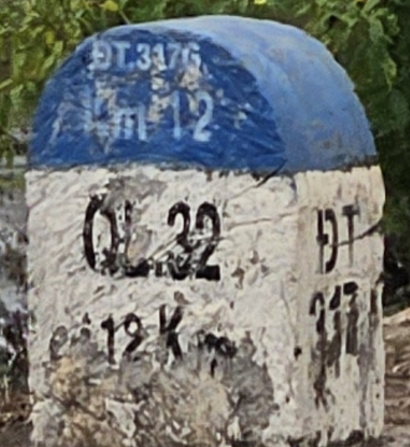
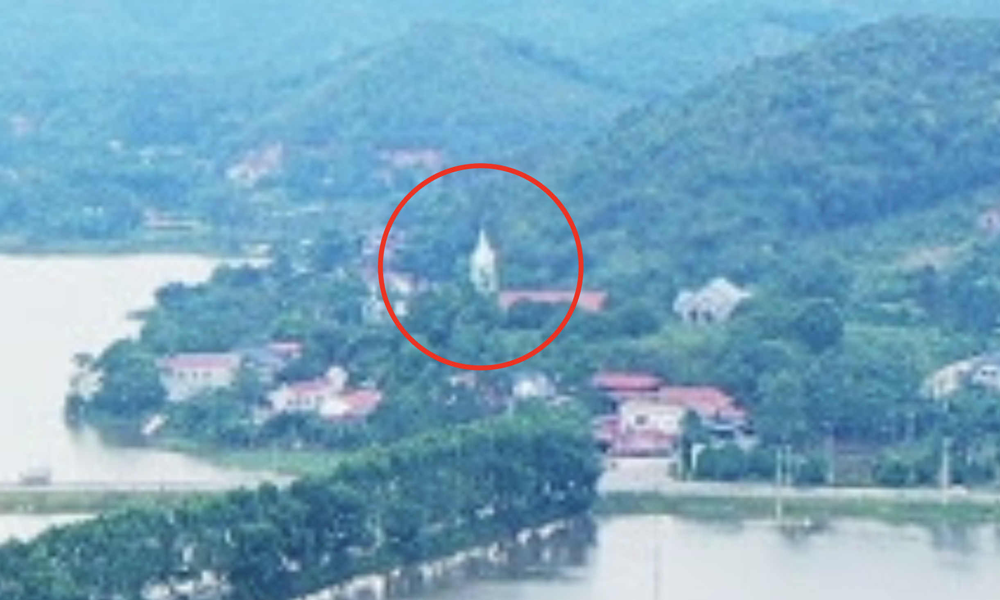
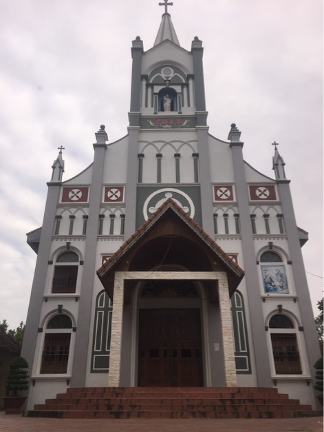
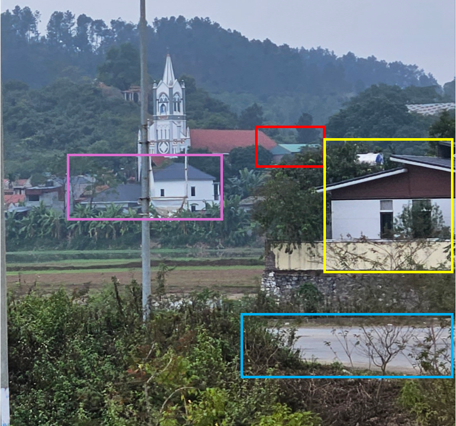
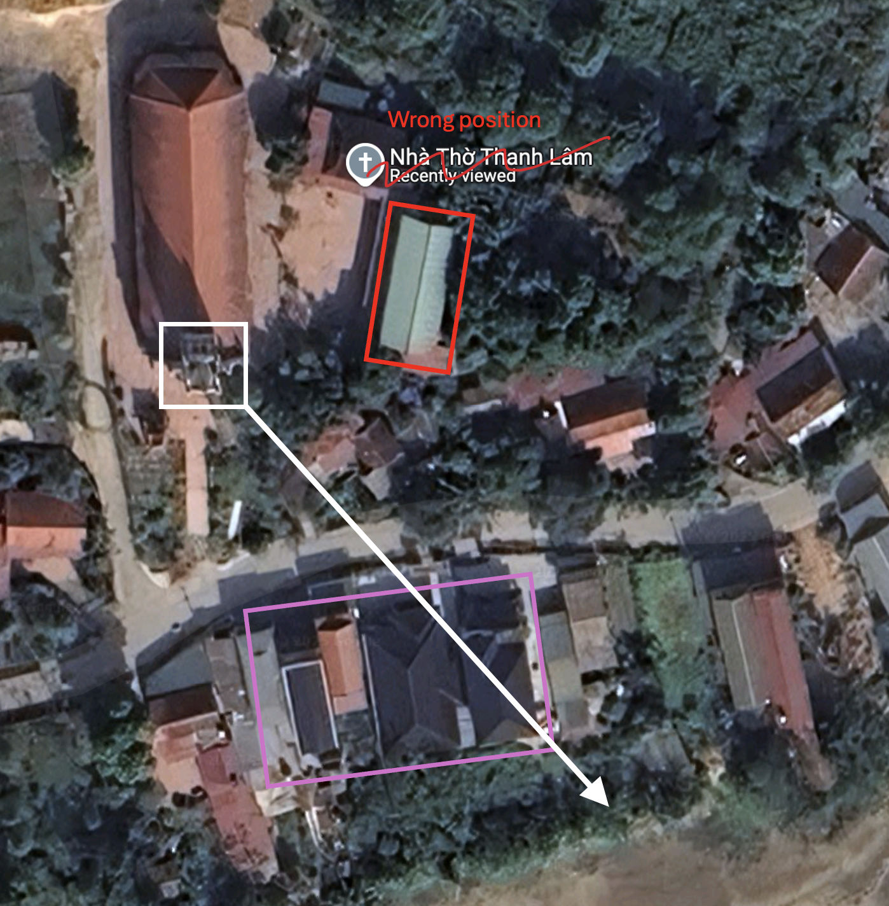
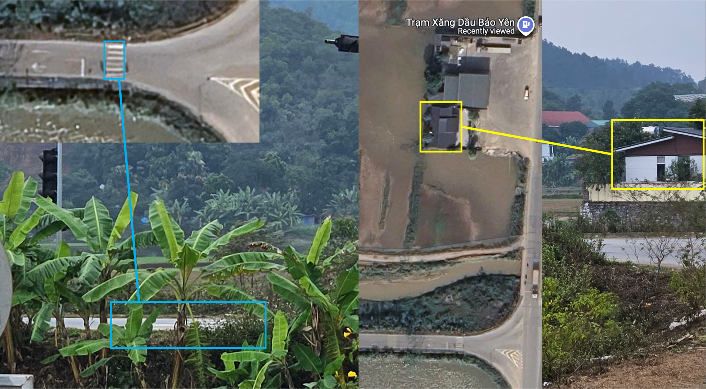

# By The Banana Tree

## 题目简述

题目给出一张越南乡村景观照片，要求确定拍摄点的经纬度，并识别远处教堂。坐标需四舍五入到小数点后三位，教堂名称按 Google Maps 的名称转成小写并删除空格、标点和变音符号。


## 解题过程

先放大前景里程碑。其蓝色顶部与侧面可辨认出 `ĐT 317`，主面还能读到 `QL.32` 与 `12 Km`：



越南省道里程碑通常使用白色碑身和蓝色或绿色顶部，因此当前道路应是 `ĐT317`；`QL32` 更像里程起算端点。又因为里程碑沿道路起点到终点方向每公里设置在右侧，可以从 `QL32` 与 `ĐT317` 的交会处沿 `ĐT317` 量取约 12 公里，得到初始搜索区。该区域街景覆盖很少，所以继续利用公开航拍照片球和卫星图比对水田、山体与建筑。

在靠近水田和远山的照片球中可以看到一座白色教堂：



地图标注和近景照片确认它是 `Nhà Thờ Thanh Lâm`：



仅确认教堂还不足以确定拍摄点。题图中，黑顶建筑几乎位于视点与教堂的同一直线上，绿顶建筑偏右，前景道路另一侧还有一栋房屋：



将这些相对方位投到卫星图上，可以约束视线方向：



沿该方向向后搜索，第一处路口的斑马线和房顶形状也与题图一致：



拍摄点坐标约为北纬 $21.153$、东经 $105.274$；教堂名去除空格和变音符号后为 `nhathothanhlam`，因此：

```text
grey{N21-153_E105-274_nhathothanhlam}
```

## 方法总结

本题把道路设施识别与无完整街景条件下的视觉地理定位结合起来。有效流程是先用里程碑的道路编号和距离缩小范围，再用远山、水域、教堂和建筑排列确定方向，最后用路口细节锁定视点。地图量距只能给出候选区域，真正使结论闭环的是多个独立视觉地标在同一几何关系下同时吻合。
