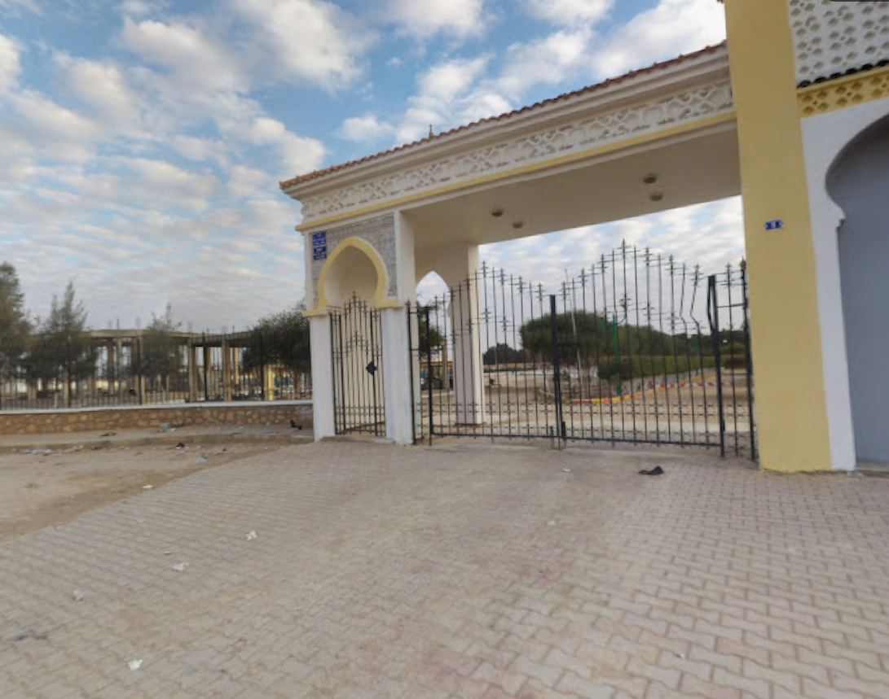

# ta7wissa

## 题目简述

题目只给出一张入口大门照片，要求定位拍摄地点。图片没有 EXIF/GPS 元数据，决定性证据来自建筑风格、干旱环境、墙面与门柱上的小型标牌，以及公开地图/街景中的视觉比对，因此应从原仓库 `misc` 调整到 OSINT。

## 解题过程

先检查原始 PNG：尺寸为 $1091\times859$，只带 sRGB 信息，不含 EXIF 或 GPS 字段，不能通过元数据直接得出答案。



图中可用于缩小范围的信号包括：

- 带马蹄形拱和白黄配色的北非建筑风格；
- 法语/阿拉伯语环境常见的蓝色门牌样式；
- 平坦、较干燥的城市边缘景观；
- 大门后方为围栏包围的林地或公共休闲空间。

结合题目名的旅行/散步语义，把搜索范围集中到阿尔及利亚，再用反向图片搜索或地图照片匹配大门结构。官方解答给出的坐标为：

```text
Latitude:  35.46371570758897
Longitude: 2.9055765285000192
```

将坐标放回公开地图核验，位置落在阿尔及利亚 Aïn Oussara 的 Cité Ahmed Zabana / Sorec sud 一带，靠近地图标注的 `El Ghaba (Le Bosquet)`。可以用[该坐标的 OpenStreetMap 视图](https://www.openstreetmap.org/?mlat=35.46371570758897&mlon=2.9055765285000192#map=19/35.46371570758897/2.9055765285000192)继续核对道路、围栏和林地的相对方向；正文已经保留了地点、坐标和关键视觉证据，不依赖链接才能知道结论。

公开仓库的官方 solution 只记录经纬度，没有提供平台最终提交格式或 flag 字符串，因此这里不杜撰 `shellmates{...}` 包装，坐标就是能够由现有证据确认的答案。

## 方法总结

- 核心技巧：在无 GPS 元数据时，结合建筑、标牌、气候与周边空间布局做图像地理定位，再用地图影像验证精确坐标。
- 识别信号：单张街景图、无其他附件、解答以经纬度呈现时，主要障碍是公开来源检索与地标比对，应归 OSINT。
- 复用要点：反向图片搜索只负责提供候选，最终要用门洞数量、立柱、围栏、道路与背景地物做多点一致性验证；不要仅凭“像某个国家”就给出坐标。
