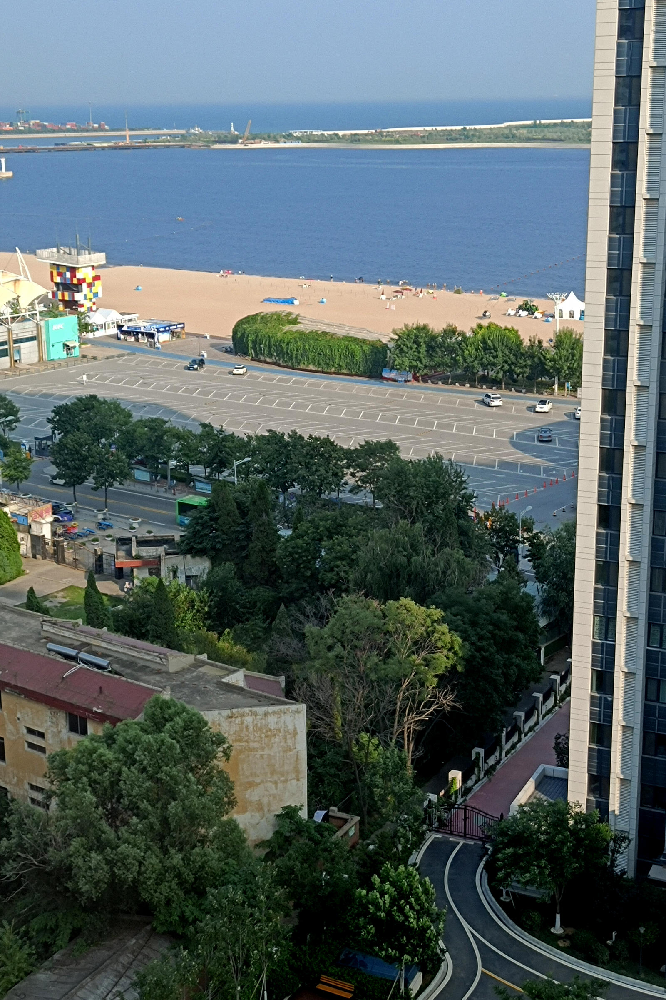

# 旅行照片

## 题目简述

题目只给出一张从高层住宅拍摄的海滨照片，要求判断拍摄朝向、时间、楼层，以及画面中肯德基的电话和相邻建筑名称。可用线索包括太阳与阴影、太阳能热水器朝向、对面楼层的水平关系、海岸设施和门店外观。



## 解题过程

### 朝向与时间

照片中低层建筑屋顶的太阳能热水器通常朝南布置；结合画面中海岸线和楼体位置，可判断镜头大致朝东南。阴影方向以及太阳从西侧照入的状态说明已经接近傍晚，合理答案是约 `17:00`，原始拍摄时间约为 16:48。

### 楼层

观察右侧同高度住宅：相机的水平视线与对面约第 14 层相交。两栋楼层高接近，拍摄点也应在 14 层附近，因此填写：

```text
14
```

### 地点、电话与相邻建筑

画面同时出现沙滩、近岸设施和醒目的肯德基小楼。以这些组合特征搜索海滨肯德基，能定位到秦皇岛新澳海底世界附近的门店。再用地图商户资料和门店照片交叉验证，门店电话为：

```text
0335-7168800
```

肯德基旁边的场馆招牌是：

```text
海豚馆
```

五项答案组合为“东南、17:00、14、0335-7168800、海豚馆”，提交后得到：

```text
flag{D0n7-5hare-ph0t05-ca5ua11y}
```

## 方法总结

- 核心技巧：把一张照片拆成太阳方向、楼层透视、建筑用途和商户信息四条相互独立的证据链。
- 识别信号：海岸照片中的连锁门店、独特场馆、屋顶设施和建筑水平线都比宽泛的景色描述更适合检索。
- 复用要点：先用视觉特征缩小城市和景区，再用地图、门店电话和街景照片交叉确认；不要让单一搜索结果承担全部结论。
