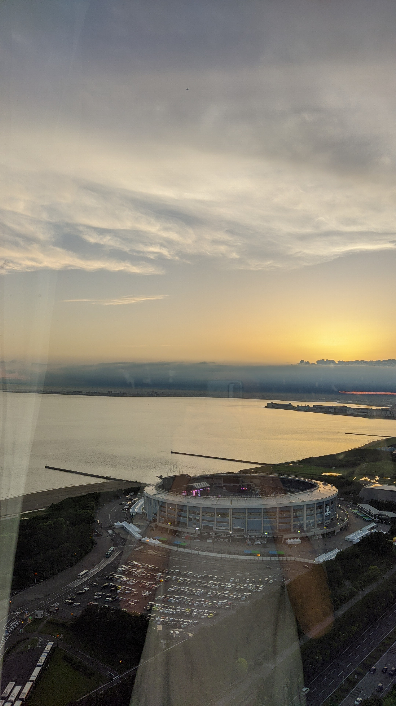
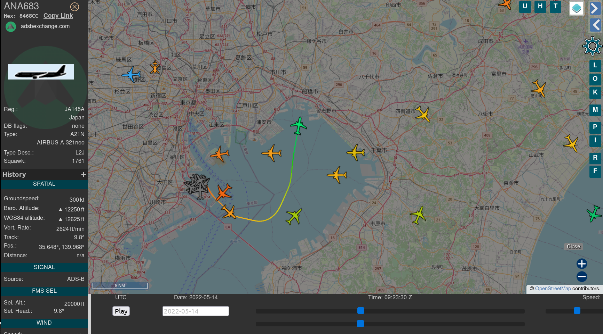

# 旅行照片 2.0

## 题目简述

题目给出一张未经压缩的手机原图，要求先读取 EXIF 中的版本、厂商、ISO、拍摄日期和闪光灯状态，再根据照片中的球场、海岸线、玻璃反射和远处飞机，推断酒店区域邮编、手机屏幕分辨率以及航班的起降机场和航班号。手机系统时间可信，因此照片的精确时间可以直接用于历史航迹回放。



## 解题过程

### EXIF 信息

使用 `exiftool` 查看原图：

```bash
exiftool hotel-window-view.jpg
```

关键字段为：

```text
Exif Version        : 2.31
Make                : Xiaomi
Camera Model Name   : sm6115 (juice)
ISO                 : 84
Date/Time Original  : 2022:05:14 18:23:35
Flash               : Off, Did not fire
```

因此第一部分依次填写：

```text
2.31
小米/红米
84
2022/05/14
否
```

EXIF 还给出了手机代号和精确拍摄时间，这两项会继续用于第二部分。

### 球场、酒店区域与邮编

放大照片下方圆形建筑，可以辨认其外墙横幅：

```text
WELCOME TO ZOZOMARINE STADIUM
```

它对应日本千叶市的 ZOZO Marine Stadium。球场本身的邮编是 `261-0022`，但题目问的是拍照人所在地点。根据画面中左侧海面、右侧陆地、球场位于窗下的相对位置，可判断拍摄点在球场东侧至东南侧的酒店群。地图上的酒店区域属于相邻邮区 `261-0021`，题目要求去掉连字符，所以答案为：

```text
2610021
```

### 手机型号与屏幕分辨率

EXIF 的型号 `sm6115 (juice)` 是关键检索串。`juice` 对应 Redmi 9T，在中国大陆对应 Redmi Note 9 4G；其屏幕规格为 2340×1080。因此填写：

```text
2340x1080
```

这个结论既与设备代号匹配，也与玻璃反射中竖直手机的外形相符。规格可在[小米 Redmi 9T 官方页面](https://www.mi.com/global/redmi-9t/specs)核对。

### 历史航迹回放

拍摄时间是日本标准时间 `2022-05-14 18:23:35 +09:00`，换算成 UTC 为：

```text
2022-05-14 09:23:35 UTC
```

在 ADS-B Exchange 的历史回放中定位东京湾和千叶海洋球场，并查看该时刻。照片朝向西北，画面中的飞机也沿相符方向飞行；`09:23:30 UTC` 附近只有 ANA683 的位置与照片吻合。



`ANA683` 是 ADS-B 呼号，公开航班资料显示其商业航班号为 `NH683`，固定航线为东京羽田机场到广岛机场：

```text
起飞机场：HND
降落机场：HIJ
航班号：NH683
```

一分钟后附近还会出现 JL329，因此必须使用 EXIF 的秒级时间、飞机方位和飞行方向共同消歧，不能只凭“附近有航班”下结论。

## 方法总结

- 核心技巧：把 EXIF、可见地标、地图方位、设备代号和历史 ADS-B 航迹串成一条相互校验的证据链。
- 识别信号：原始照片保留拍摄时间和设备字段，同时画面出现独特建筑、玻璃反射或远处交通工具时，应联合元数据与视觉线索分析。
- 复用要点：注意题目问的是拍摄点而非地标邮编；航迹时间需要统一到 UTC，并用视角和方向排除同一地区相邻时刻的其他航班。
