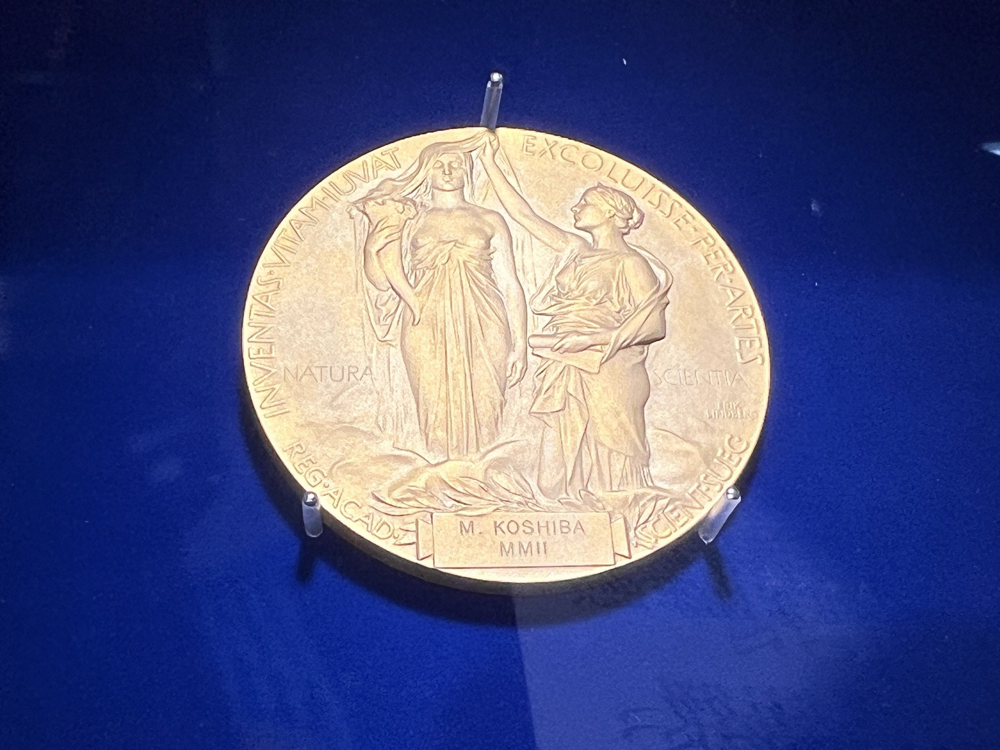
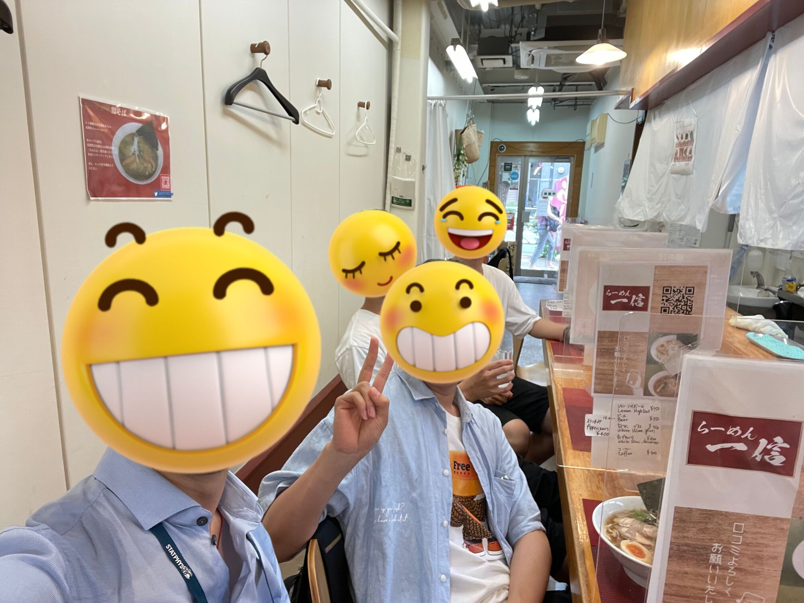
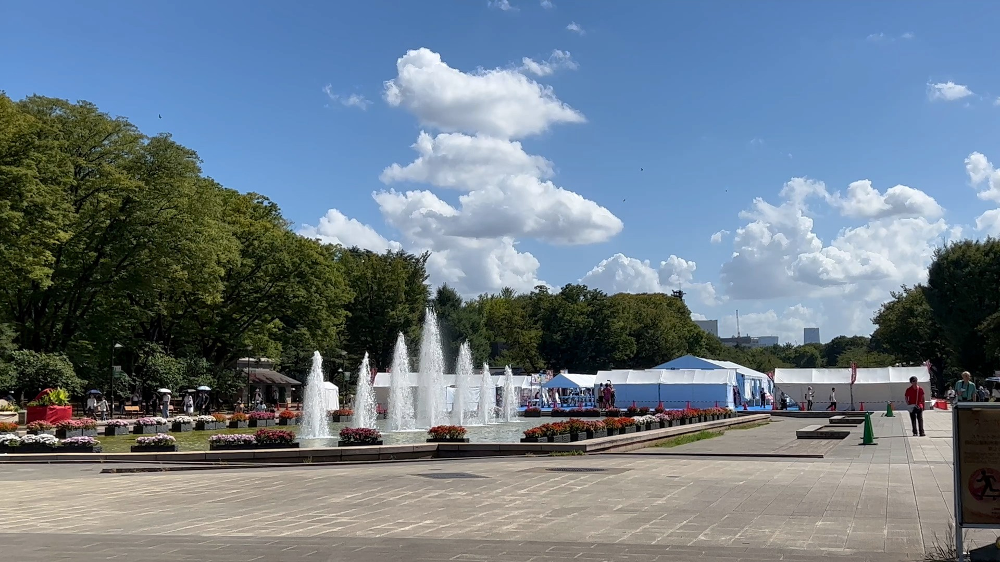
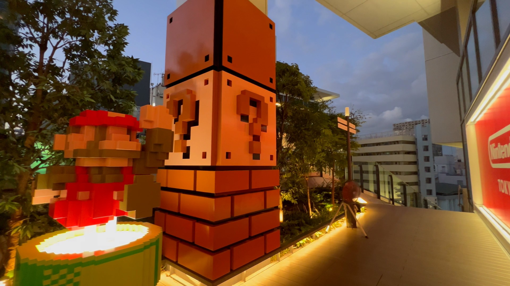

# 旅行照片 3.0

## 题目简述

题目给出四张东京旅行照片，要求从画面中的文字、场所和行程线索回答六项问题：见面日期、奖牌得主所属研究所、活动报名表编号、博物馆票价、晚宴集合地，以及上野站与涩谷广告中的动物。最终答案依次为：

```text
2023-08-10
ICRR
S495584522
0
安田讲堂
熊猫-秋田犬
```

## 解题过程

### 从奖牌和胸牌确定学校、会议与研究所

第一张照片中的奖牌底部可辨认出 `M. KOSHIBA`，即东京大学校友小柴昌俊的诺贝尔物理学奖牌。



以姓名和奖牌展览为关键词，可定位东京大学理学部的 [Science Gallery 诺贝尔奖展页](https://www.s.u-tokyo.ac.jp/en/gallery/nobelprize/)。比较该展厅中同类金色奖牌得主的出生年份，出生最晚者是梶田隆章；他获奖时任职于东京大学宇宙线研究所，其英文缩写是 `ICRR`。

第二张照片左侧人物的胸牌挂带上写有 `STATPHYS28`，背景店铺文字可辨认出“一信拉面”。店铺位置在东京大学本乡校区附近，而 [STATPHYS28 官网](https://statphys28.org/)记载会议于 2023 年 8 月 7 日至 11 日在东京举行，两项线索彼此吻合。



### 用上野公园活动锁定日期和表单编号

第三张照片可通过喷泉、博物馆建筑朝向和广场布局定位到上野公园喷泉广场；画面中大量帐篷仍在搭建，说明活动尚未开始。



在会议的 8 月 7 日至 11 日时间窗内检索该广场活动，可找到“全国梅酒まつりin東京2023”。活动在 8 月 10 日 15:00 开始，照片描述的午间搭建状态与开幕前准备相符，因此见面日期是 `2023-08-10`。继续进入活动的志愿者招募页，其在线表单地址以 `/S495584522` 结尾，题目要求的问卷编号即 `S495584522`。

### 博物馆、晚宴和涩谷路线

东京国立博物馆当时的普通大学生常设展票价是 500 日元，但这不是本题答案。馆方 Campus Members 规则说明成员学校师生可免费参观常设展，东京大学在成员名单中，因此身为东大学生的学长实际支付 `0` 日元。

STATPHYS28 的 8 月 10 日日程把 18:00 至 20:00 标为 Banquet。会议的[晚宴说明页](https://statphys28.org/banquet.html)进一步说明这是屋形船晚宴，并要求参加者 18:00 在 Yasuda Auditorium 南侧集合；对应简体中文建筑名为 `安田讲堂`。

最后一张照片明确拍到 `NINTENDO TOKYO`，由上野搭乘 JR 山手线前往该店应在涩谷站下车。



检索上野站中央检票口外的“ボタン＆カフリンクス”活动，可在同期记录中看到粉色海报反复使用熊猫图案，所以动物 A 是“熊猫”。涩谷站附近楼顶的整点 3D 报时广告展示秋田犬，动物 B 是“秋田犬”，合并为 `熊猫-秋田犬`。

## 方法总结

本题依赖公开网页、地图、活动记录和照片细节的关联验证，决定性障碍是地理与事件 OSINT。可靠的路线是先从照片中提取高区分度实体（姓名铭文、会议缩写、店名、建筑布局），再用时间窗口和地理位置交叉约束候选事件。票价题还提醒我们区分“标价”与“实际支付”：身份优惠属于答案条件，不能停在搜索结果中的普通票价。四张原始照片保留用于承载不可等价文本化的视觉线索；地图、搜索结果和网页截图则已转写为可检索的文字证据。
