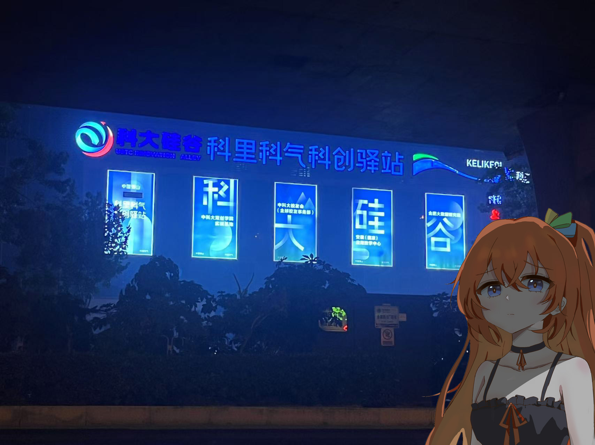
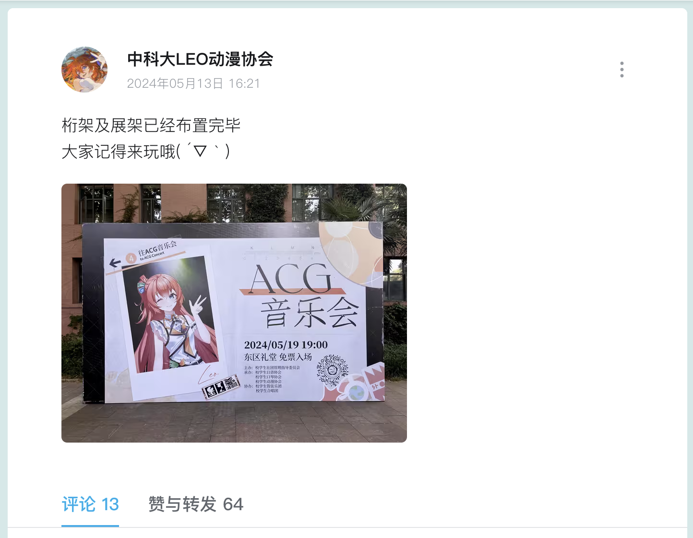
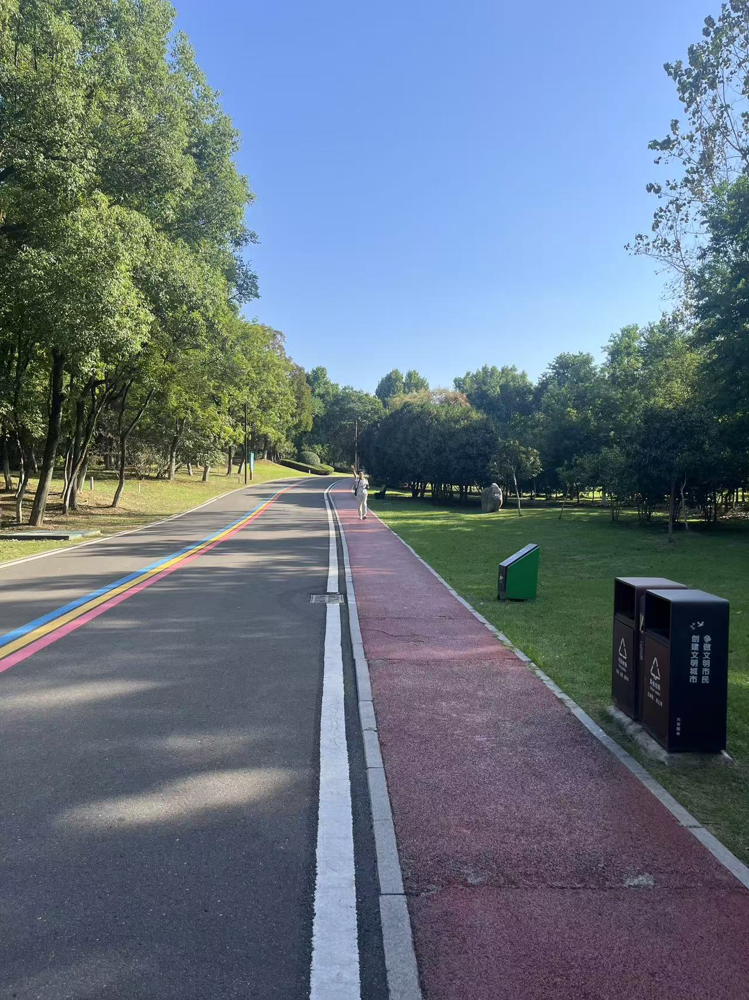
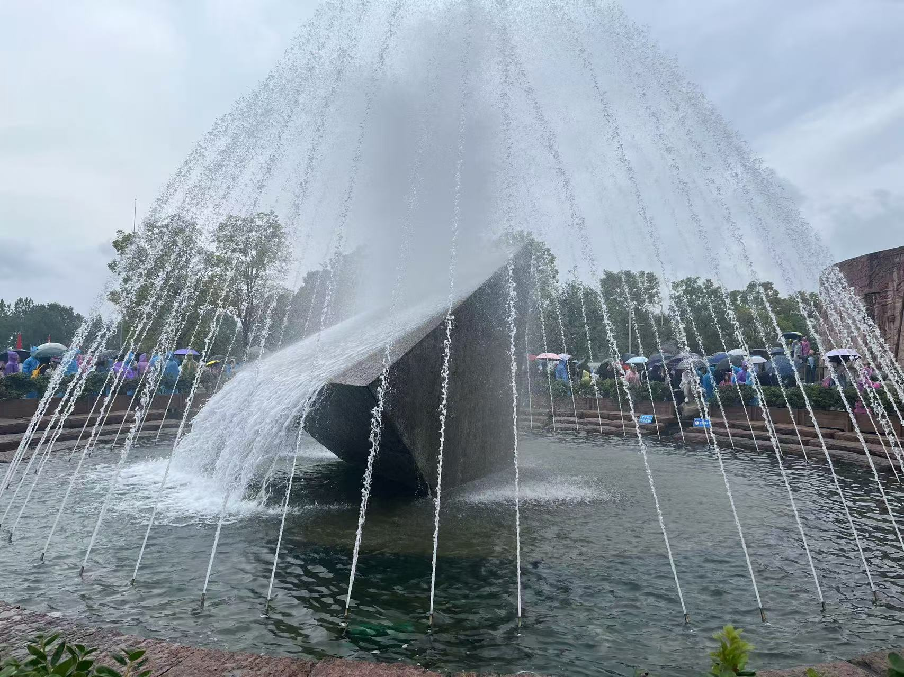
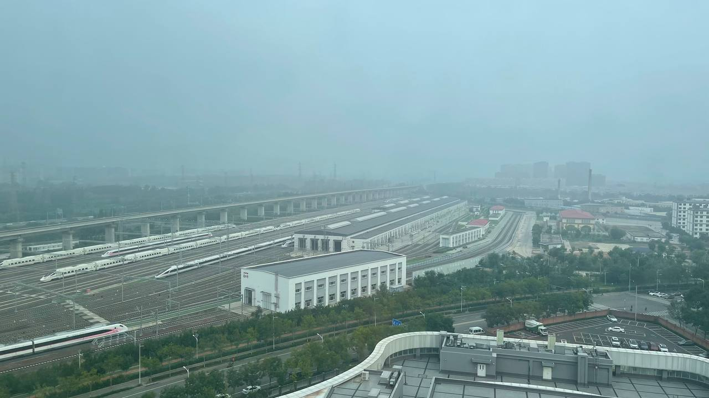

# 旅行照片 4.0

## 题目简述

题目给出四组照片线索，要求完成地点、活动日期、公园、景点、铁路设施和动车型号的关联定位。关键证据包括店面文字、社交平台活动海报、垃圾桶上的属地标识、独特喷泉造型，以及四编组粉色动车和周边建筑布局。主要障碍是从弱视觉线索构造检索词，再用地图、社交平台和公开铁路资料交叉验证。

## 解题过程

### 1. 科创驿站与校门



照片招牌可读出“科里科气科创驿站”。直接搜索会混入产业园项目，因此需要在本地地图中区分“科里科气新智造产业园”“中国蜀山科学岛科里科气科创驿站”和“科里科气科创驿站（科大站）”。将最后一个地点与中科大校门位置比较，最近的是 `东校区西门`。

### 2. LEO 与 ACG 音乐会

以“中科大 LEO 动漫协会”等关键词找到中科大 LEO 动漫协会的公开账号，再沿动态查找桁架布置记录。海报明确写有 ACG 音乐会时间 `2024/05/19 19:00`：



因此按题目格式提交 `20240519`。需要区分动态发布日期 5 月 13 日与海报上的活动日期 5 月 19 日。

### 3. 六安的公园



反向搜图效果不佳，但右下角垃圾桶上的“六安园林”提供了属地锚点，路面的红黄蓝三色跑道提供了景观特征。组合检索“六安 公园 三色跑道”，并用本地生活平台图片比对，定位为 `中央森林公园`。

### 4. 喷泉景观



这张照片缺少可读文字，但喷泉中心的多面体造型辨识度高。百度识图结果能匹配三峡大坝旅游区的坛子岭景观，答案为 `坛子岭`。Google 反向图片搜索在该样本上没有给出有效匹配，说明同一线索应尝试不同搜索引擎。

### 5. 动车所、附近医院与车型



左下角列车是少见的四编组动车。用“四编组动车”“粉色涂装 CRH6”等关键词可缩小到怀密线使用的 `CRH6F-A`。沿北京市郊铁路怀柔—密云线检查动车设施，并用车库、道路和红顶建筑布局比对，可定位到 `北京北动车运用所`；其附近医院为 `积水潭医院`。

仓库当前官方 README 的第 5 问写作“图片中的建筑全称（八个汉字）”，对应答案是 `北京北动车运用所`。同期选手资料中的比赛页面版本则写作“距离拍摄地最近的医院”，对应答案是 `积水潭医院`。两种表述使用的是同一条定位证据链，提交时应以实际页面的问题文本为准。

当前官方 README 六项答案可整理为：

```text
东校区西门
20240519
中央森林公园
坛子岭
北京北动车运用所
CRH6F-A
```

## 方法总结

- 核心技巧：从图片中提取文字、属地设施、涂装、编组和建筑布局等弱线索，再用地图、社交动态、反向搜图和专业资料交叉验证。
- 识别信号：小字往往比主体更有区分度；活动动态的发布时间不等于活动日期；铁路型号必须同时匹配编组、涂装和运营线路。
- 复用要点：反向搜图失败时应转向人工 OCR 和组合关键词；不同国内外搜索引擎、地图与内容平台的索引范围不同。最终地点要用卫星图或周边结构闭环验证，不能只凭搜索结果标题。
