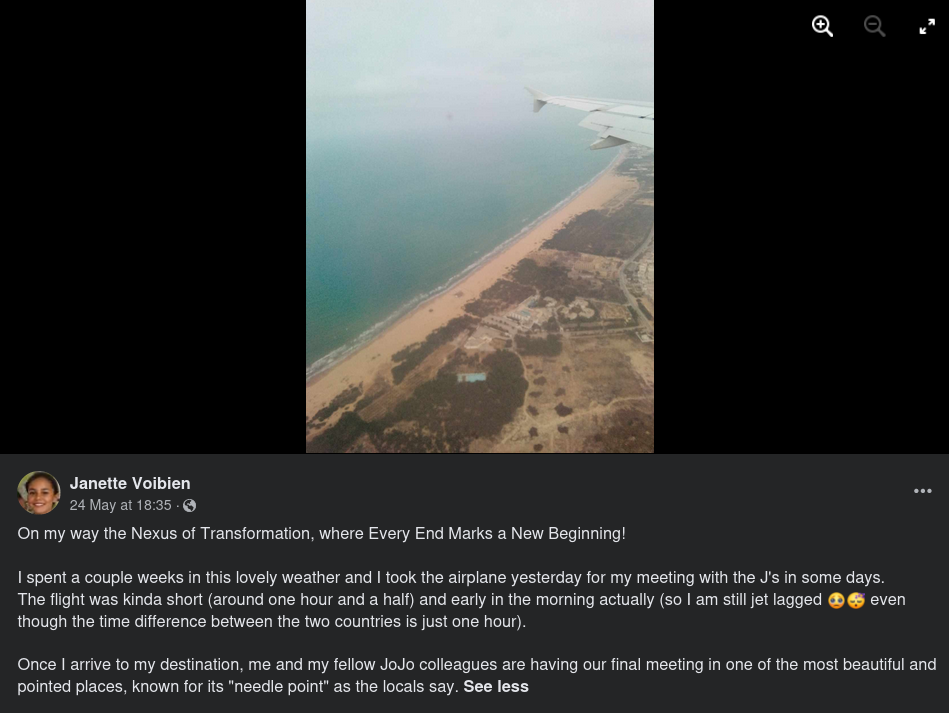

# Jojo Unleashed

## 题目简述

题目给出一段 MP3，要求确定绑架者最终会议的日期和地点。解题需要把音频识别、文件元数据、地点评论、公开 Google Calendar、GitHub Pages 历史快照、社交媒体照片和航班线索串成一条可验证的 OSINT 证据链。

flag 格式为：

```text
N0PS{DD-MM-YYYY_place}
```

## 解题过程

### 从歌曲和元数据定位第一处地点

音频识别结果是 Jacques Brel 的歌曲《Jojo》。对 `recording.mp3` 执行：

```bash
exiftool recording.mp3
```

Comment 字段说明：会面地点位于歌曲提到的第一个地点以东，是一座以该地点全名命名的城堡。

歌曲首先提到 `Saint Cast`。完整地名是 `Saint-Cast-le-Guildo`，其东侧符合描述的城堡为 `Château du Guildo`。

### 从评论者公开日历确定日期

城堡的公开评论中，账号 `JustineJB123` 留言提到了 Jojo。其个人资料公开邮箱：

```text
jorabetagnyjustine@gmail.com
```

用 GHunt 查询该 Google 账号时发现公开 Calendar，包含三次会议：

| 事件 | UTC 时间 |
| --- | --- |
| First Meeting | 2022-06-03 20:30 |
| Second Meeting - Almost There | 2023-06-03 20:30 |
| Final Meeting - Last Step - Jojo is coming | 2024-06-03 20:10 |

因此最终会议日期确定为：

```text
03-06-2024
```

### 从历史网站找到下一名成员

第二次会议的描述感谢 `@trebogosse` 维护组织网站。该用户名对应一个公开 GitHub Pages 项目，当前页面明确称自己是“新的第二版”，说明旧版本可能仍在网页归档中。

[2024-05-04 的 Wayback 快照](https://web.archive.org/web/20240504181359/https://trebogosse.github.io/trepogosse/)保存了旧版 manifesto；其中署名是：

```text
Janette Voibien
```

这里保留精确快照链接，是因为“旧版页面在特定时间包含该署名”属于历史来源证据；正文已完整概括其关键内容，无需依赖链接理解结论。

### 用飞行照片与文字线索确定地点

搜索 Janette Voibien 的公开社交账号后，可以找到一篇 2024 年 5 月 24 日发布的帖子：



帖子给出的独立线索包括：

- 照片反向搜索指向突尼斯北部海岸，最近的大型机场是 Tunis-Carthage；
- 帖子称航班发生在“昨天”，即 2024 年 5 月 23 日星期四；
- 起飞较早，飞行约 1.5 小时；
- 出发地和目的地时差约 1 小时；
- 最终会面地被当地人称作 “Needle Point”。

按日期、时段和飞行时长缩小后，候选航线主要为 Tunis 到 Lyon、Toulouse 或 Nice。`Needle Point` 翻译为法语 `Pointe de l'Aiguille`，搜索结果对应 Nice 附近 Théoule-sur-Mer 的海滨地点，因而与 Tunis-Nice 航线相互印证。

最终地点规范化为：

```text
theoule-sur-mer
```

组合日期和地点得到：

```text
N0PS{03-06-2024_theoule-sur-mer}
```

## 方法总结

- 核心技巧：用歌曲元数据确定首个地理锚点，再沿公开评论、日历、历史网页和社交照片逐层关联人物与最终地点。
- 识别信号：题目文字要求同时回答日期和地点，而单一来源只提供其中一部分；日历给出日期，航班与地名双关共同约束地点。
- 复用要点：OSINT 结论应由多个独立条件交叉验证。反向图片结果只确定出发区域，飞行时长只产生候选，`Pointe de l'Aiguille` 才把候选收敛到 Nice 周边；任何一项单独使用都不足以确认最终答案。
