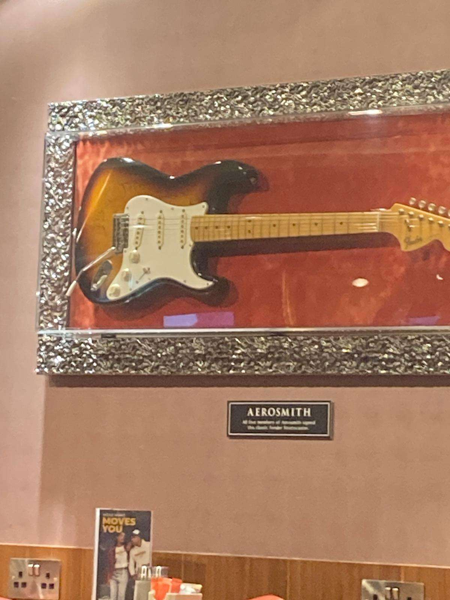

# Rockstar

## 题目简述

题目给出一张餐厅墙面陈列照片，要求找出该地点菜单所使用的制作软件。图片中的核心视觉线索是装框吉他、`AEROSMITH` 铭牌以及摇滚主题陈设：



需要先通过图片反向搜索确定具体门店，再取得该门店的主菜单 PDF，并读取文档元数据中的 Creator 字段。

## 解题过程

对原图做反向图片搜索，匹配到同一把吉他的场所照片，地点是：

```text
Hard Rock Cafe Malta Airport
```

这里必须保留 `Airport` 限定。Hard Rock 在 Malta 的其他门店也有菜单，误入 Valletta 门店会下载到另一份 PDF，其 Creator 是 `Adobe InDesign CS6 (Windows)`，不是本题答案。

沿 Hard Rock Cafe 官方地点页面进入 Malta Airport 门店，在 Menu 区域选择主餐饮菜单，而不是 Messi 联名菜单。下载该 PDF 后执行：

```bash
exiftool MIA_Eats_Drinks_Menu_2024.pdf
```

关键元数据为：

```text
Creator : Adobe InDesign 19.0 (Windows)
```

题目询问的是制作软件，Creator 字段已经直接给出产品、版本和平台。按原字符串提交：

```text
N0PS{Adobe InDesign 19.0 (Windows)}
```

菜单地址属于会随门店更新而变化的资源，且旧 URL 已不适合作为长期复现依赖，因此不保留具体 PDF 外链；正文已经说明如何从官方门店页面定位正确菜单以及应验证的元数据。

## 方法总结

- 核心技巧：用陈列物反向搜索精确定位门店，再从对应门店的菜单 PDF 元数据中读取制作软件。
- 识别信号：题目问“软件”而不是地点，说明地理定位只是中间步骤；最终证据应来自 PDF 的 Creator 或 Producer 元数据。
- 复用要点：连锁品牌的同城门店容易混淆。应同时核对图片匹配、门店全名和菜单类型，避免从视觉上相似但错误的门店取得元数据。
