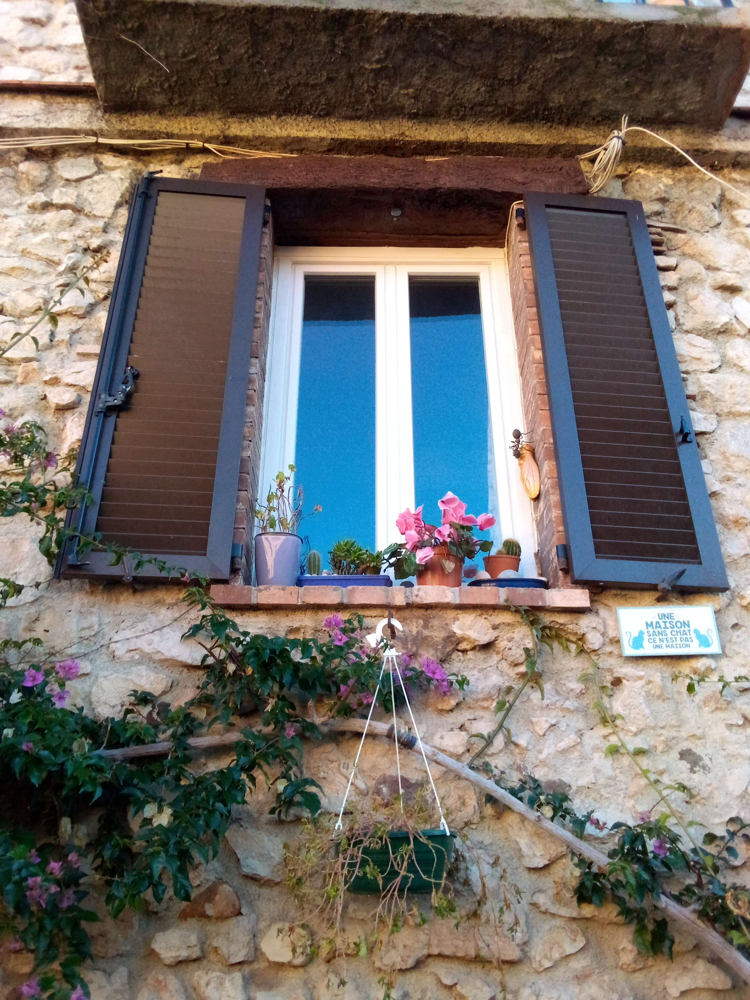

# Where Am I 2

## 题目简述

图片拍到石墙、蓝色窗户、木制百叶窗和一块法语猫咪标牌：



标牌文字为：

```text
Une maison sans chat, ce n'est pas une maison
```

它只能把范围初步指向法语地区。题目要求进一步给出城市和街道，因此还要从反向图片搜索得到更宽视角，并用住宿地址与街景核对具体位置。

## 解题过程

以完整图片和窗户右下方标牌分别做反向搜索，多个相似结果把地点指向：

```text
Antibes, France
```

其中同一组照片还包含更宽的街道视角。用宽视角继续检索，匹配到 Antibes 老城一处公寓住宿页面；页面公开地址为：

```text
Rue du Haut Castelet
```

最后在地图街景中沿该街道核对以下细节：

- 不规则浅色石墙；
- 蓝色窗框与深色木百叶；
- 窗下花盆和攀援植物；
- 右下角相同的法语猫咪标牌。

这些特征共同确认城市和街道：

```text
Antibes, Rue du Haut Castelet
```

题面说明中“ASCII lowercase”与其示例、官方接受结果的大小写并不一致。为忠实保留官方答案，本篇使用官方给出的首字母大写形式，并以连字符连接各词：

```text
N0PS{Antibes-Rue-du-Haut-Castelet}
```

## 方法总结

- 核心技巧：先用可读法语和局部图像定位城市，再用同组宽视角照片关联住宿地址，最后以街景细节确认门牌所在街道。
- 识别信号：局部照片只能提供国家或城市线索；同一摄影组的其他角度往往包含更适合地址检索的街景结构。
- 复用要点：商业页面给出的地址需要用独立街景证据复核。提交时还应注意题面格式说明与官方答案是否冲突，不能在没有证据时自行改写已确认的 flag 大小写。
