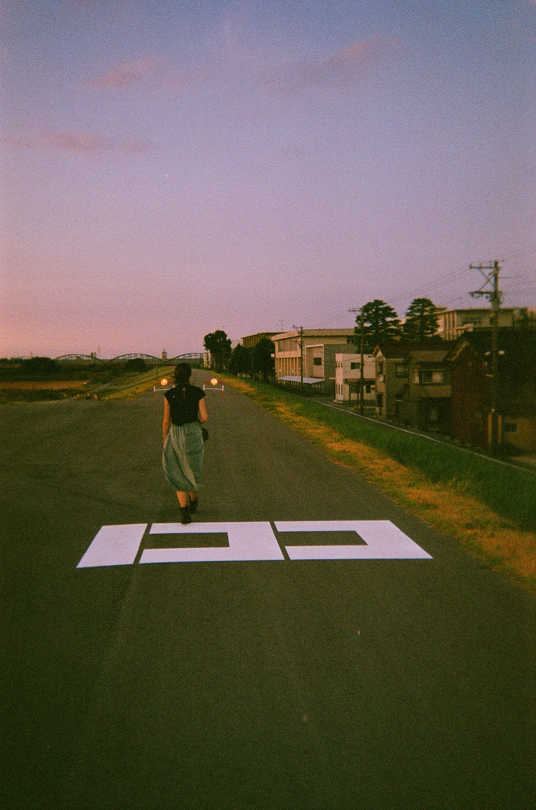

# Where Am I 3

## 题目简述

题目要求识别拍摄者前方背景中的桥。原图包含日本式道路停止标记、河堤道路、低层建筑和远处连续的蓝色拱形桥：



图中没有可直接搜索的拉丁文字，需要先判断国家和拍摄方向，再按桥型筛选并用街景逐项比对。

## 解题过程

### 确定国家与大致朝向

路面的白色停止标记、道路尺度、建筑和电线杆样式共同指向日本。天空呈日落色，亮部位于画面左侧；在日本日落方向大致为西，因此相机很可能面向北方。

背景桥具有约四段重复拱形、整体偏蓝。按“日本、拱桥、河堤道路、北向视角”检索桥梁列表，[神通大橋条目](https://ja.wikipedia.org/wiki/%E7%A5%9E%E9%80%9A%E5%A4%A7%E6%A9%8B)把范围收敛到富山市神通川一带。该条目在这里是区域锚点，不能单独作为最终桥名证据。

### 用街景复核拍摄点

在附近河堤道路逐段检查街景，[坐标 `36.6936649, 137.2017777` 的视角](https://www.google.fr/maps/@36.6936649,137.2017777,3a,60y,5.32h,85.45t/data=!3m6!1e1!3m4!1sNvHgFm0mBbAz7njlwxNpYg!2e0!7i16384!8i8192?coh=205409&entry=ttu)能够同时匹配：

- 路面停止标记的形状与位置；
- 右侧连续低层建筑和电线杆；
- 左侧河堤边界；
- 正前方蓝色多拱桥的相对高度与跨度。

这些一致特征确认了拍摄道路。再读取该位置前方桥梁的地图名称，并按赛事官方接受的英文拼写规范化为：

```text
toyamao-bridge
```

因此 flag 为：

```text
N0PS{toyamao-bridge}
```

桥名的日文罗马字存在不同写法；这里不擅自“修正”已经由官方 WP 和赛事 flag 明确给出的 `toyamao` 拼写。

## 方法总结

- 核心技巧：利用日本道路标记确定国家，以日落方向约束朝向，再用桥型筛选和街景多特征比对确定拍摄点与桥名。
- 识别信号：单个蓝色拱桥候选很多，但道路标记、建筑轮廓、河堤和桥的相对位置可以形成近似唯一的组合指纹。
- 复用要点：候选桥梁页面只负责缩小范围，最终定位必须回到原图视角验证。地名转写可能存在多个罗马字版本，提交时应以赛事已验证格式为准。
