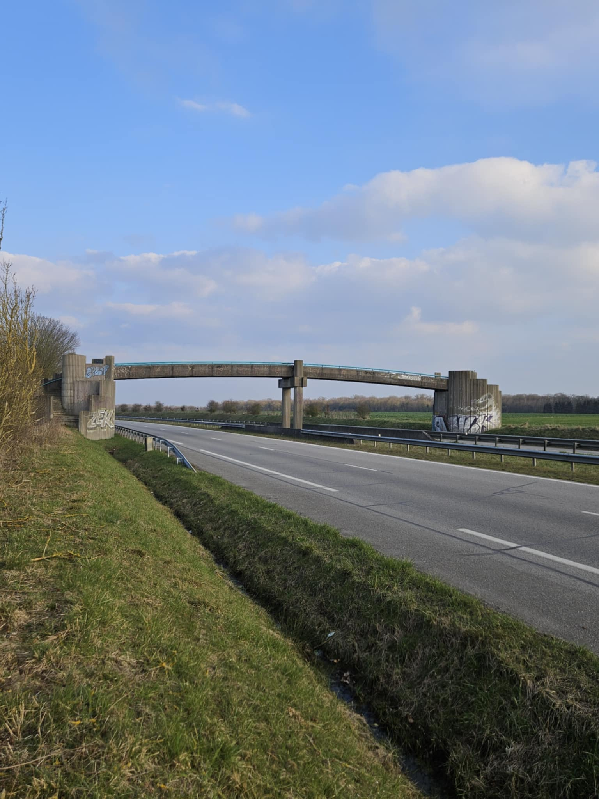
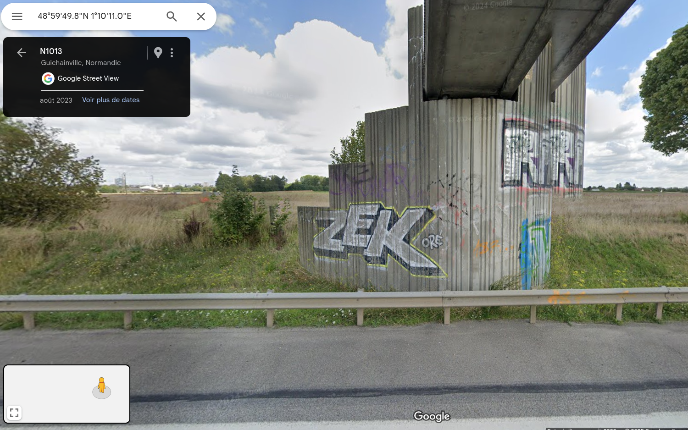

# La foire n'est pas sur le pont

## 题目简述

题目给出一张乡间快速路与涂鸦天桥的照片，要求定位这座桥，并提交它在 OpenStreetMap 中对应的对象 ID。



## 解题过程

对整座桥做反向图片搜索没有有效结果，但裁剪左侧桥墩的 `ZEK` 涂鸦后，可以找到 Oré 发布的 [同一纪念涂鸦照片](https://www.flickr.com/photos/ore-el-quetzalcoatl/19986846168/in/photostream/)。其说明写明作品位于公路旁，是献给 2004 年去世的 Zek 的纪念作。这把普通涂鸦变成了可关联作者和地域的独特线索。

继续调查 Oré 的个人资料可知，他的街头艺术活动主要集中在法国诺曼底，尤其是 Caen 一带；采访资料还指出其家乡是 Évreux。因此目标道路应位于 Caen 或 Évreux 附近。结合原图可以进一步提取：

- 道路是穿过农田的双向分隔快速路；
- 桥靠近城市边缘，因此桥墩上存在多处涂鸦；
- 候选国道包括 Caen 附近的 N13、N814，以及 Évreux 附近的 N13、N1013；
- 农田地貌和道路结构与 Évreux 南侧的 N1013 最吻合。

在 Overpass Turbo 中筛选诺曼底范围内 N1013 及与其相交的桥梁对象：

```text
[out:json];
{{geocodeArea:Normandie,France}}->.searchArea;
nwr["ref"="N 1013"]["highway"](area.searchArea)->.n1013;
nwr["bridge"]["layer"](area.searchArea)->.bridges;
nwr.bridges(around.n1013:0);
(._;>;);
out qt;
```

逐个检查靠近 Évreux、位于农田中的候选对象，最终定位到坐标约 `48.997172, 1.169718` 的 [OpenStreetMap way 452508047](https://www.openstreetmap.org/way/452508047)。街景中的桥梁结构、田野背景以及桥墩上的 `ZEK` 和 `ORÉ` 字样都与题图一致：



题面把目标称为“node ID”，但实际对应的 OSM 元素类型是 `way`。按官方要求的大小写格式提交：

```text
N0PS{Way_452508047}
```

## 方法总结

定位无法直接反搜的场景时，应把画面拆成独特局部线索。这里的有效链条是“ZEK 涂鸦 → 作者 Oré → 诺曼底活动范围与 Évreux 家乡 → N1013 候选桥 → OSM/街景视觉确认”。最终不能只凭地貌判断，还要同时比对桥型、道路、田野和涂鸦，并核对 OSM 对象类型与 ID。
