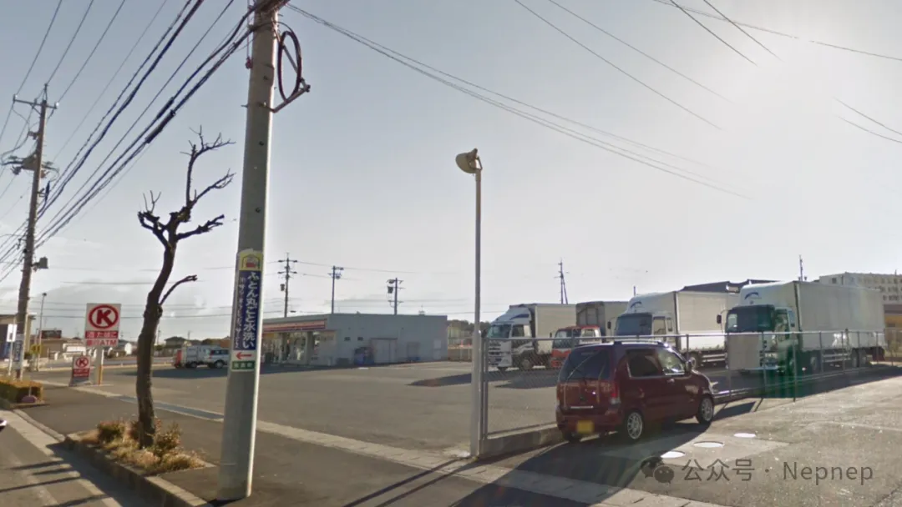
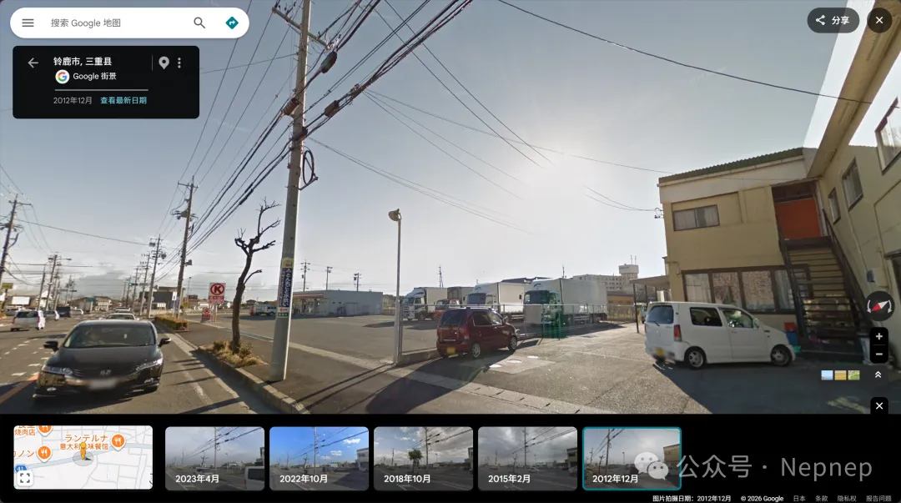

# NepCTF2026 Call me to find me Writeup

## 题目简述

题目把旧式加密语音软件、对话代理和地理定位串成一条链。题面提到“上世纪末的加密通话软件”以及作者曾因密码软件出口问题被美国执法机关调查，指向 Phil Zimmermann 的 PGPfone。连接对方后，需要取得参考照片，定位拍摄地点，并提交该位置附近可接受的 What3Words 三词地址。

决定性信息来自外部公开资料和街景交叉验证，因此归入 OSINT。

## 解题过程

### 建立 PGPfone 通话

可正常运行的目标版本为 PGPfone 2.1 for Windows，其 SHA-256 为：

```text
0e049967f61fda850db5b31225da6af92972728c9d41ba7b95bb8bafab096db4
```

原程序把 UDP 端口硬编码为 `17447`，而靶机端口是动态给出的。可选处理方式包括：

- 在另一台主机或虚拟机上把 UDP `17447` 转发到题目地址；
- 使用 WinDivert 重写目标 UDP 端口；
- 给 PGPfone 打补丁；
- 修改公开源码后重新编译。

通话代理拥有 `send_chall_jpg` 和 `check` 两个工具。正常交流或提示词注入均可促使其调用前者发送参考照片；后者会验证输入中是否按顺序包含一个可接受的 What3Words 三词组合。题目内置了 154 组邻近答案，因此三词地址并非唯一。

### 定位参考照片

对方发来的原始街景线索如下：



按以下证据逐步收敛：

1. 电线杆样式更接近日本中部或北陆地区；
2. 杆上可辨认出地名“住吉町”；
3. 道路标志显示县道 41 号；
4. 候选县道与“住吉町”相交后，主要剩下三重县铃鹿市和富山县富山市；
5. 照片中的 Circle K 已在品牌整合后变为 FamilyMart，可用现有门店反查旧址；
6. FamilyMart 铃鹿住吉店及周边道路形态与照片一致。

切换到 2012 年历史街景后，可以在店铺附近复现拍摄角度：



因此目标在日本三重县铃鹿市住吉町、原 Circle K/现 FamilyMart 铃鹿住吉店附近。查询该点周边 What3Words 地址，任选题目接受的三词组合，保持英文单词顺序提交给对话代理；`check` 返回成功后会给出 flag。

官方 flag 模板为：

```text
NepCTF{meet_me_at_midnight_oooh_oooh_oooh_woah}
```

## 方法总结

这条链中，旧软件识别只负责取得照片，最终定位仍要依赖多条可独立验证的地理证据。可靠顺序是“地名 → 道路编号 → 城市交集 → 商业品牌迁移 → 历史街景”，而不是只凭建筑外观猜测。归档时保留原始线索图与最终街景对照图即可，中间搜索页面和文字截图都可以转写为正文。
