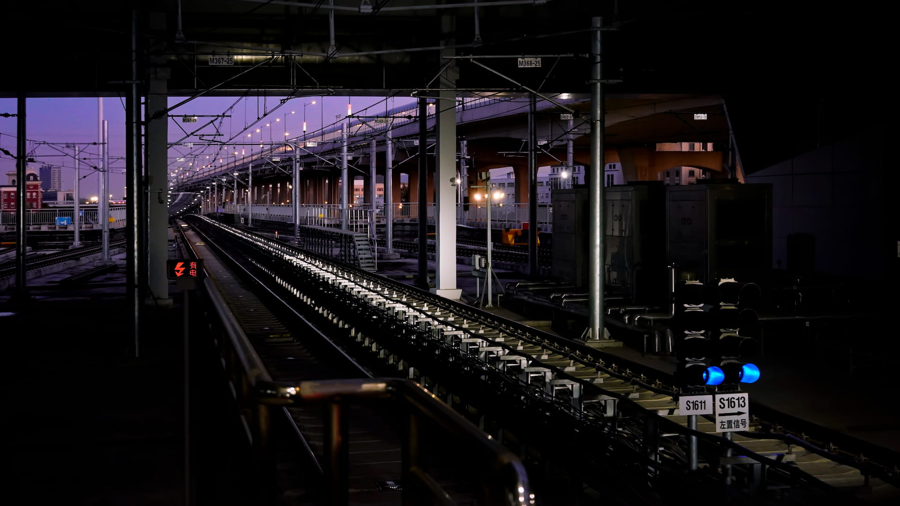

# Transit

## 题目简述

题目只给出一张从轨旁拍摄的中国城市轨道交通照片，要求判断具体车站，flag 格式为：

```text
R3CTF{city_station_name_station}
```

原图中没有可直接读取的站名，但接触网支柱编号、信号标志、列车编号、线路颜色和高架环境可以逐级收敛范围。



## 解题过程

先放大原图并记录可核验的视觉线索：

- 接触网悬挂牌出现 `M367-25`、`M368-25` 一类编号；
- 蓝色信号标志附近可见 `S1611`、`S1613` 和“左置信号”字样；
- 线路为高架区段，旁边还有并行的高架道路；
- 远处列车采用青绿色/湖蓝色视觉元素。

`S1611`、`S1613` 更像信号机编号，不应误当成车辆编号。最有区分度的是 `M368` 样式的接触网牌。以“城市名 + 地铁 + 接触网标志/轨道”检索各城市公开轨道照片，对比可排除北京、上海、成都等常见系统；杭州地铁公开照片中出现了相同样式且编号同为 `M368` 的标志，从而确定城市为杭州。

在对应公开照片中还能读到车辆编号：

```text
190181
```

结合青绿色线路标识和杭州车辆资料，可将列车归到杭州地铁 19 号线。该线大部分位于地下，公开线路资料列出的高架站只有四个：

```text
御道站
平澜路站
耕文路站
知行路站
```

接着比较四站附近的线路走向、与杭甬高速高架的平行关系、道路宽度、绿化和建筑背景。旧街景拍摄时间早于 19 号线建设，不能把“街景中没有轨道”当成排除证据；应结合更新的线路施工/试运行视频和站点周边照片。最终与原图轨道、高架道路及接触网位置匹配的是知行路站。

按题目要求把城市和英文站名转为小写下划线格式：

```text
R3CTF{hangzhou_zhixing_road_station}
```

[Transit 完整 OSINT 记录](https://maplebacon.org/2024/06/r3ctf-yuanhengctf2024-Transit/)保留了各城市接触网牌、杭州车辆和四个高架站的对照图片。本文已将外链中的筛选逻辑、候选列表和旧街景陷阱完整写入正文，外链主要用于视觉复核。

## 方法总结

交通地理定位应优先使用“制度化、重复出现”的基础设施特征，而不是泛化的城市景观。接触网牌格式先确定运营系统，车辆编号和线路颜色再确定线路，线路形态最后缩小到站点。对快速建设地区，街景日期是关键元数据；历史影像与现状不一致时，应改用同时间段的施工、试运行或乘车视频交叉验证。
