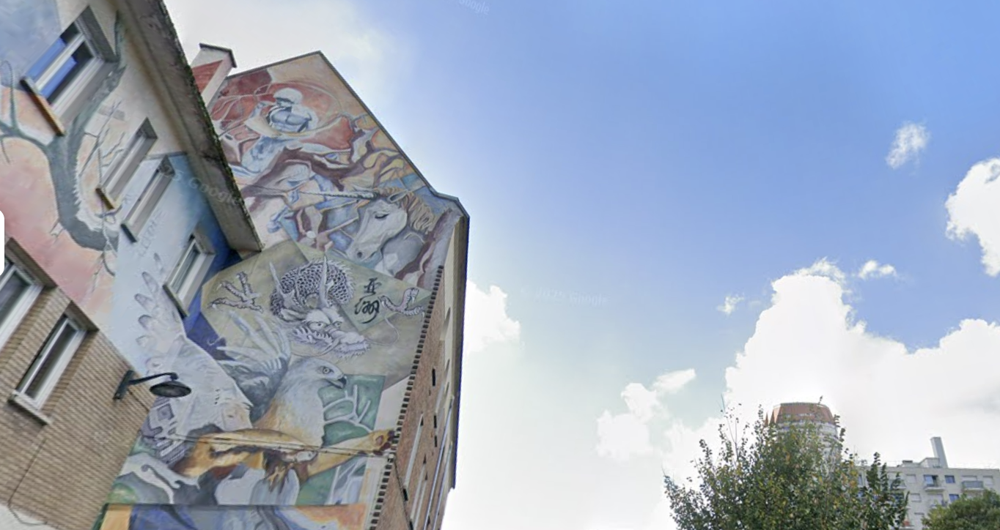

# R3GIRL in Paris

## 题目简述

题目给出一张巴黎街景照片，要求确认画面中建筑的原名，以及墙面涂鸦的作者；最终只保留建筑名和艺术家的名字，并按题目规则去除重音、用连字符分隔。



照片中的决定性线索不是普通商铺招牌，而是墙上由奇幻动物、红色龙、独角兽和人像组成的大型转角壁画。它足以把搜索范围从整个巴黎缩到第十三区的一处固定公共艺术作品。

## 解题过程

### 先定位壁画

对照片主体做反向图片检索，并组合搜索画面特征：

```text
Paris mural dragon unicorn child corner wall
Paris 13e fresque animaux fantastiques
```

可匹配到壁画：

```text
De tous pays viendront tes enfants
```

公共艺术目录记录它位于巴黎第十三区 `rue des Malmaisons` 与 `avenue de Choisy` 的转角，作者为：

```text
Cyril Vachez
David N.
```

[巴黎第十三区公共艺术作品列表](https://fr.wikipedia.org/wiki/Liste_des_%C5%93uvres_publiques_du_13e_arrondissement_de_Paris) 同时列出了作品名、两位作者和该路口，因而可以交叉确认不是相似画作。

### 确认题目所问的建筑

沿地址检查街景，壁画紧邻 `27 avenue de Choisy` 的天主教堂：

```text
Église Notre-Dame-de-Chine
```

教堂资料显示它位于巴黎第十三区、地址正是 `27 avenue de Choisy`，由旧堂区活动室改建，并服务当地华人天主教团体。由此可知题目要求的 building 不是壁画标题，也不是附近的 `Église Saint-Hippolyte`，而是 [Église Notre-Dame-de-Chine](https://fr.wikipedia.org/wiki/%C3%89glise_Notre-Dame-de-Chine_de_Paris)。

### 按格式整理

题目要求：

- 建筑使用原名；
- 去掉字母重音；
- 单词之间使用 `-`；
- 艺术家只取名字，并按已知顺序排列。

因此：

```text
Église Notre-Dame-de-Chine -> Eglise-Notre-Dame-de-Chine
Cyril Vachez               -> Cyril
David N.                    -> David
```

最终得到：

```text
R3CTF{Eglise-Notre-Dame-de-Chine-Cyril-David}
```

该结果也与仓库 checker 中的大小写敏感模板完全一致。

## 方法总结

这类街景 OSINT 应先识别高唯一性的艺术作品，再用作品目录取得作者和精确路口，最后通过地址与街景确认题目真正询问的建筑。仅搜“巴黎教堂壁画”容易把邻近的 Saint-Hippolyte 与 Notre-Dame-de-Chine 混淆；地址、建筑资料和 checker 三方一致后再按格式化规则提交。
