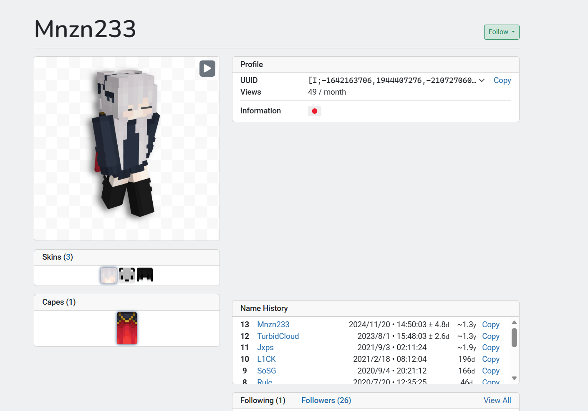
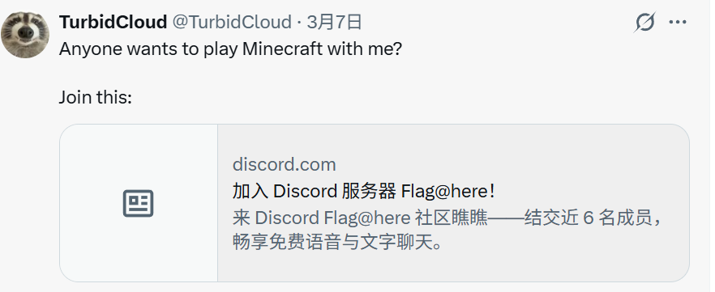
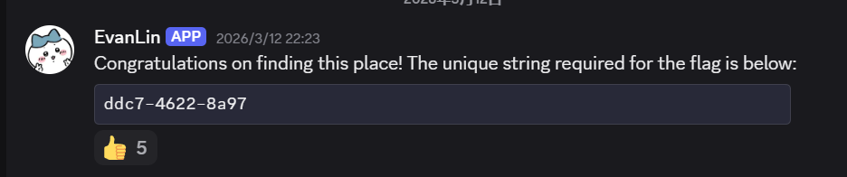

# SUCTF 2026 - SU_CyberTrack

## 题目简述

这是一道人物轨迹关联 OSINT 题。题面给出一个个人博客，要求分别恢复目标人物的姓名和一个特殊字符串，再按以下规则计算 flag：

```text
md5(lowercase(<姓><名> + "_" + <字符串>))
```

姓名必须“姓在前、名在后”，删除空格且不加其它分隔符。两条调查线可以并行：博客头像和邮箱自动回复用于确认姓名；Minecraft 用户名、历史昵称和社交账号用于找到特殊字符串。

## 解题过程

### 1. 从博客建立线索表

题目入口是 [EvanLin-SUCTF 的博客](https://evanlin-suctf.github.io/)。历史站点日后可能下线，因此关键内容必须写进题解，而不能只留链接。七篇日记提供的高价值信息是：

```text
today               -> 宠物 Momo，是布偶猫
sad                 -> 最近更换过头像
normal life         -> 出现 shukuang、kanna.seto 等人名
don't spam          -> 邮箱域为 foxmail.com，且开启自动回复
how they found me?? -> 旧网名能关联到其它平台
Happy birthday      -> 生日线索 11 月 23 日
play with me T_T    -> Minecraft 用户名 Mnzn233
博客昵称             -> EvanLin
```

不要把所有词都平均看待。`foxmail.com`、`1123`、`EvanLin` 和头像哈希可以直接收敛邮箱；`Mnzn233` 与“旧网名”则明确指向游戏平台历史昵称。

### 2. 姓名分支：Gravatar 邮箱哈希

博客头像来自：

```text
https://gravatar.com/avatar/
105e127d86711d05460e6072f7d809c5c9e0fe095ca7631e4c2e0ffc4acc3fa9
```

Gravatar 当前的官方说明指出，头像地址中的标识可由“邮箱去除首尾空白、转小写后计算 SHA-256”得到；见 [Gravatar 头像文档](https://docs.gravatar.com/sdk/images/)。因此目标哈希不是加密邮箱，而是一个可离线验证的候选判定器。

根据博客线索生成小规模社工字典，例如组合：

```text
evan / lin / evanlin
1123 / 20241123
mnzn233 / momo
@foxmail.com
```

逐个验证：

```python
import hashlib

target = '105e127d86711d05460e6072f7d809c5c9e0fe095ca7631e4c2e0ffc4acc3fa9'

for local in candidates:
    email = (local + '@foxmail.com').strip().lower()
    if hashlib.sha256(email.encode()).hexdigest() == target:
        print(email)
        break
```

命中邮箱：

```text
evanlin1123@foxmail.com
```

博客已经提示该邮箱启用了自动回复。向它发送普通邮件后，自动回复签名给出姓名 `Zeyuan Lin`。按题目要求改成姓在前、名在后并删除空格，最终姓名部分是：

```text
linzeyuan
```

### 3. 邮箱的非预期捷径

出题人把博客部署到 GitHub Pages 时，提交元数据中意外保留了邮箱。查看 [泄露邮箱的 GitHub commit patch](https://github.com/EvanLin-SUCTF/EvanLin-SUCTF.github.io/commit/2796f3b4537dc0c1891da002dc9d02ab9f71b008.patch)，可直接看到 `evanlin1123@foxmail.com`，从而跳过 Gravatar 字典构造。

这条链接应保留：commit hash 固定，且它本身就是非预期路径的原始证据。它只能替代“找邮箱”这一步，仍需通过自动回复确认真实姓名，不能仅凭邮箱本地部分猜测姓名。

### 4. 字符串分支：Minecraft 历史昵称

在 [NameMC 的 Mnzn233 档案](https://namemc.com/profile/Mnzn233.1) 中可以看到多个历史昵称，其中关键旧名是：

```text
TurbidCloud
```



以 `TurbidCloud` 搜索其它公开社交平台，能够定位到同名账号。该账号发布过寻找 Minecraft 玩家并附带 Discord 邀请的内容，服务器名包含 `Flag@here`，说明身份关联已经闭合。



进入服务器后，题目 bot/账号直接给出特殊字符串：

```text
ddc7-4622-8a97
```



Discord 邀请和社交帖子具有时效性，长期题解不必保留可能失效的邀请 URL；这里已经记录了用于关联的账号名、服务器提示和最终字符串，不依赖外链也能理解证据链。

### 5. 计算 flag

严格按题目规则拼接：

```text
linzeyuan_ddc7-4622-8a97
```

复算：

```python
import hashlib

s = 'linzeyuan_ddc7-4622-8a97'.lower()
print(hashlib.md5(s.encode()).hexdigest())
```

结果为：

```text
c4d1df3b3dbea17c886b447b7f913048
```

所以提交：

```text
SUCTF{c4d1df3b3dbea17c886b447b7f913048}
```

## 方法总结

- 先把线索按目标拆成两条证据链：邮箱/姓名与游戏昵称/特殊字符串；不要在线性浏览中混淆不同线索的用途。
- Gravatar URL 中的 SHA-256 是候选验证器。结合邮箱域、生日和昵称构造小而有依据的字典，比无边界爆破更可靠。
- Git 历史、邮件自动回复、游戏历史昵称和社交邀请分别提供“邮箱”“姓名”“旧身份”和“最终落点”；只有把这些证据闭环，结论才不是同名猜测。
- 外链分为两类：稳定的原始证据（固定 commit、公开档案）应保留；临时邀请和易失效帖子应把关键信息写入正文后省略 URL。
