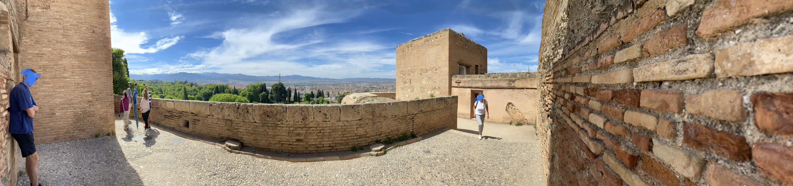

# trip

## 题目简述

题目给出一张旅行全景照，要求判断拍摄地点，并按 `tjctf{place-name}` 提交，地点名称必须是小写、无空格、单个词。画面中没有可读招牌，主要线索是伊斯兰风格砖砌城墙、铺石步道、塔楼、远处城市与山地地形。

## 解题过程

原图具有直接的地理定位价值：



将整张图和右侧砖墙、中央方形塔楼等局部区域分别提交反向图片搜索，结果集中指向西班牙格拉纳达的阿尔罕布拉宫。再做视觉交叉验证：

- 建筑使用红褐色夯土与砖石城墙，符合 Alhambra 名称所指的“红色城堡”；
- 宫城位于高地，照片能俯瞰格拉纳达城区；
- 背景连续山脉与从阿尔罕布拉向 Sierra Nevada 方向的视野一致；
- 搜索到的游客照片中，墙体、步道和方形塔楼的相对位置与题图吻合。

题面要求一个单词，因此使用地点通行名 `alhambra`，而不是城市名 `granada` 或带空格的完整西班牙语名称：

```text
tjctf{alhambra}
```

## 方法总结

- 地理定位不能只采纳反向搜索的首个标签，应再用建筑材质、地形、天际线和固定结构位置做交叉验证。
- 全景图可能让相似度检索失真，分别裁剪稳定建筑特征通常比只上传整图更可靠。
- 最终答案还受题面格式约束；识别到“格拉纳达的阿尔罕布拉宫”后，应提交具体景点而不是所在城市。
