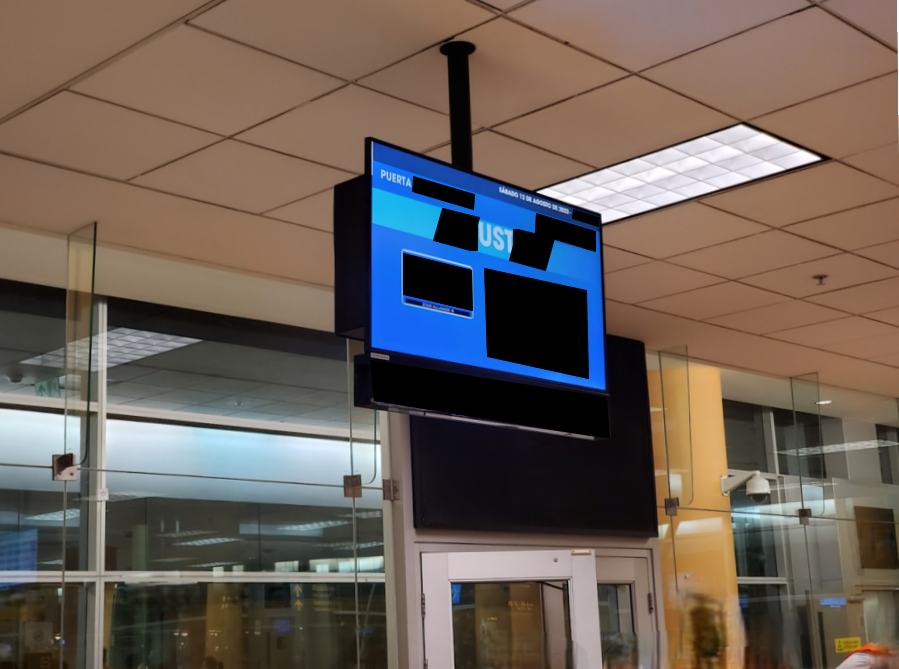

# airport

## 题目简述

题目要求根据机场登机口照片定位出发机场，并以四字母大写代码提交。题面中 `mIstake`、`traCk`、`kidnApped`、`gO` 的异常大写字母依次组成 `ICAO`，说明目标是机场的 ICAO 代码，而不是三字母 IATA 代码。

## 解题过程

照片中的视觉线索需要组合使用：



- 左上角写着西班牙语 `PUERTA`，把出发地范围收缩到西班牙语地区；
- 顶部日期为 `SABADO 12 DE AGOSTO DE 2023`，即 2023 年 8 月 12 日星期六；
- 目的地大部分被遮挡，只剩中间的 `UST`，与 `HOUSTON` 的连续片段吻合；
- 屏幕下方有 Star Alliance 标志，且窗外处于深夜或凌晨；
- 题目问“where I am”，因此 Houston 是目的地，真正要找的是始发机场。

以“2023-08-12、西班牙语地区、深夜/凌晨、飞往 Houston、Star Alliance”查询历史航班，匹配到 United Airlines `UA855`：该航班约在当地时间 00:05 从秘鲁利马飞往 Houston。利马国际机场当时的正式名称为 Jorge Chávez International Airport，其 ICAO 代码为 `SPJC`。

因此 flag 为：

```text
tjctf{SPJC}
```

## 方法总结

- 核心技巧：把屏幕语言、残缺目的地、联盟标志、日期和昼夜条件联合成历史航班查询约束。
- 识别信号：题面异常大小写直接给出 `ICAO`，用于区分四字母 ICAO 与三字母 IATA。
- 复用要点：地理定位不能只凭 `UST` 猜 Houston；应再用航空联盟、精确日期、出发时段和航班号交叉验证始发地。
