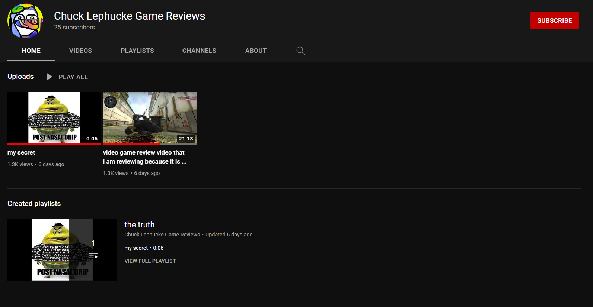
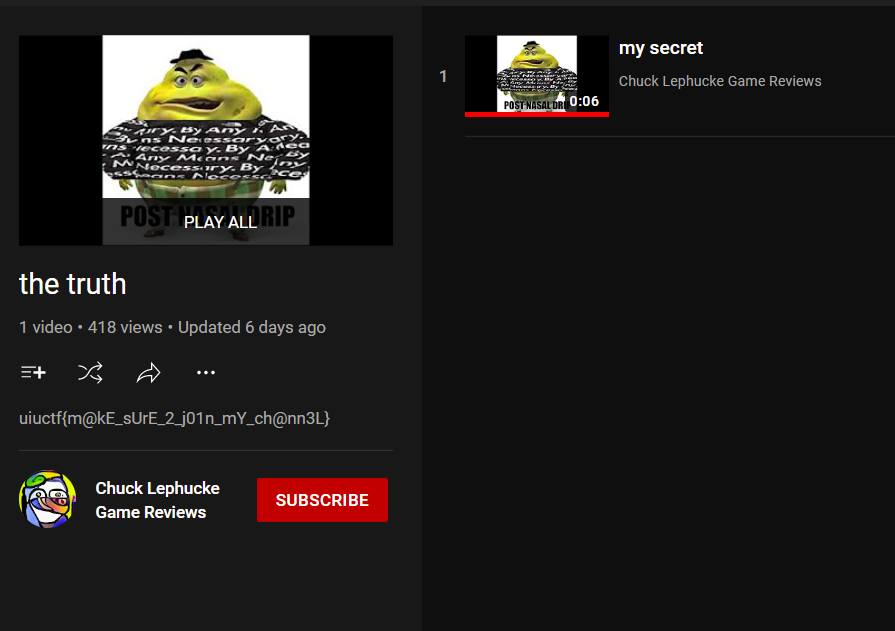

# Everyone's A Critic 2

## 题目简述

承接第一题，题目要求找到 Chuck 的 YouTube 频道，并从他整理的“好游戏”列表中取得 flag。已知人物标识为 Discord 用户 `chuck.lephucke#0038`，flag 正文以 `m@` 开头。

本题考查跨平台账号关联以及 YouTube 播放列表信息的检查。flag 不在普通视频标题里，而在播放列表的完整描述中。

## 解题过程

### 1. 用已确认的身份搜索 YouTube

以 `chuck.lephucke`、`Chuck Lephucke` 和 `game reviews` 组合检索。搜索结果中出现频道 `Chuck Lephucke Game Reviews`；进入频道后继续核对头像、名称、两段公开视频和已创建播放列表，避免把相似名称的频道当成目标。



### 2. 检查播放列表而非只看视频

题面中的“list of good games”是在提示播放列表。切换到频道的播放列表页，可以看到名为 `the truth` 的列表。

缩略卡片不会展示完整描述，需要打开列表并选择“查看完整播放列表”或展开说明。在描述中可以读到：



```text
uiuctf{m@kE_sUrE_2_j01n_mY_ch@nn3L}
```

公开页面可能随账号清理而消失，因此本地保留了能证明搜索、频道确认、播放列表定位和 flag 出处的四张截图；[参赛者的原始检索记录](https://github.com/silly-lily/CTF-Writeups/tree/main/2022_UIUCTF/osint/EveryonesACritic2)可作为独立交叉证据。

## 方法总结

跨平台 OSINT 不能停在“找到同名账号”。本题通过相同的名字、头像和内容主题把 Discord 身份关联到 YouTube，再依据题面中的 `list` 检查播放列表及其完整描述。遇到 YouTube 这类分层界面时，应依次检查频道首页、视频、播放列表、简介和展开后的描述，因为关键信息常被折叠在二级页面。

最终 flag：

```text
uiuctf{m@kE_sUrE_2_j01n_mY_ch@nn3L}
```
