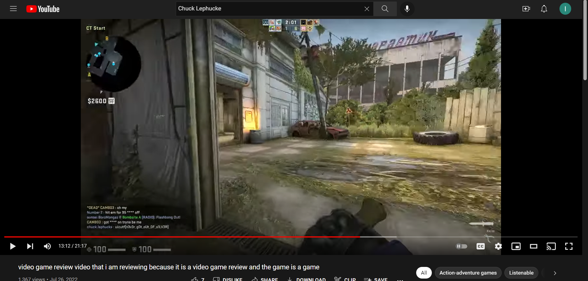

# Everyone's A Critic 3

## 题目简述

第三题继续使用 YouTube 频道 `Chuck Lephucke Game Reviews`，要求从频道中的更多内容里寻找线索。提示指出 flag 正文以 `n3` 开头。

本题的重点是检查视频本身的画面，而不是只扫描标题、简介或评论。flag 在一段较长的游戏录像中被输入到游戏聊天框。

## 解题过程

### 1. 枚举频道视频

进入已在上一题确认的频道，切换到视频列表。目标视频的标题很长：

```text
video game review video that i am reviewing because it is a video game review and the game is a game
```

标题本身没有 flag，但内容与该虚拟人物的“游戏评测”设定一致，应继续查看完整录像。

### 2. 定位游戏聊天中的文本

播放视频并重点检查可出现人工输入的区域，例如聊天框、控制台和记分板。录像约在 `12:47` 附近开始出现目标文本；留存截图的播放器时间约为 `13:12`，画面左下方的 CS:GO 聊天区仍能看到完整内容。



放大后逐字符转写，特别注意大小写和数字替换：

```text
uiuctf{n3v3r_g0t_oUt_0F_s1LV3R}
```

这里的 `oUt`、`0F` 和 `s1LV3R` 都区分大小写，不能根据自然语言习惯自行规范化。视频定位过程可由[参赛者留存的截图与说明](https://github.com/silly-lily/CTF-Writeups/tree/main/2022_UIUCTF/osint/EveryonesACritic3)交叉核对。

## 方法总结

视频 OSINT 的搜索面不只包括页面元数据，还包括每一帧中的 UI 文本。本题先利用已经确认的频道身份筛选视频，再检查最可能承载手工文本的游戏聊天区域。面对较长视频，可以先观察进度条缩略图或以较大步长跳转，发现聊天活动后再缩小时间范围逐帧确认；最后必须按画面保留原始大小写。

最终 flag：

```text
uiuctf{n3v3r_g0t_oUt_0F_s1LV3R}
```
