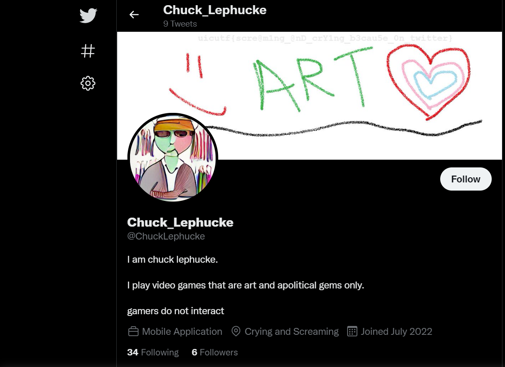

# Everyone's A Critic 4

## 题目简述

第四题要求找到 Chuck 的 Twitter 账号，并从其个人资料中发现 flag。前序题已经确定人物名称为 `Chuck Lephucke`，题目提示 flag 正文以 `sc` 开头。

关键内容藏在个人主页横幅图中，文本对比度很低；仅阅读用户名、简介和推文无法完成本题。

## 解题过程

### 1. 定位 Twitter 身份

使用完整人物名搜索 Twitter，可以找到账号 `@ChuckLephucke`，显示名为 `Chuck_Lephucke`。

该账号的简介围绕“只玩艺术且无政治内容的游戏”展开，位置字段包含 `Mobile Application` 和 `Crying and Screaming`，与题面提到的虚伪和前序视频人设互相印证。因而这不是只凭同名做出的关联。

### 2. 增强观察主页横幅

打开主页原图或放大横幅。横幅中的字符颜色与背景非常接近，但提高缩放比例、对比度后可以读出：



```text
uicutf{scre@m1ng_@nD_crY1ng_b3cau5e_0n_twitter}
```

这里有一个容易误改的细节：前缀确实是 `uicutf`，而不是赛事通常使用的 `uiuctf`。本地官方 `osint/critic-4/challenge.yml` 与历史横幅截图均保留了这个拼写，因此应原样提交。完整检索截图也可在[参赛者留存资料](https://github.com/silly-lily/CTF-Writeups/tree/main/2022_UIUCTF/osint/EveryonesACritic4)中复核。

## 方法总结

本题在身份关联之后增加了低对比度图像检查。社交平台主页应逐项检查头像、横幅、显示名、用户名、简介、位置字段和置顶内容；文字看似不存在时，应打开原图并调整缩放或对比度。转写 flag 时以原始证据为准，即便前缀看起来像笔误，也不能擅自“纠正”。

最终 flag：

```text
uicutf{scre@m1ng_@nD_crY1ng_b3cau5e_0n_twitter}
```
