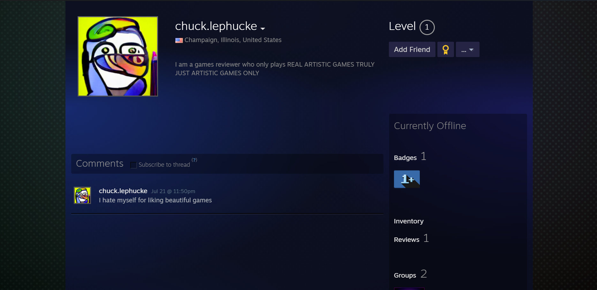
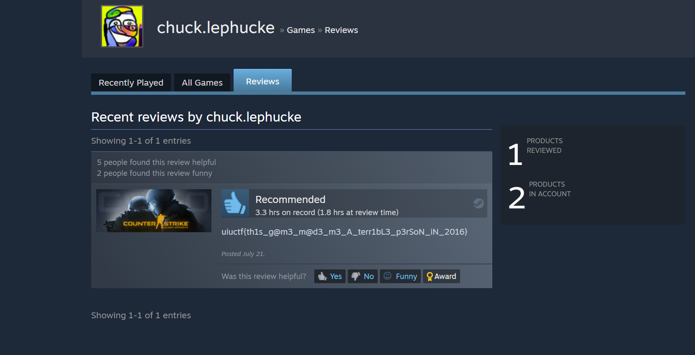

# Everyone's A Critic 5

## 题目简述

第五题要求找到 Chuck 的真实 Steam 账号，并确认他玩过哪些游戏。前序题给出的稳定标识是 `chuck.lephucke`、对应头像和游戏评测内容；提示说明 flag 正文以 `th` 开头。

flag 位于该账号发表的一条 Counter-Strike: Global Offensive 评测中。这里既要解决同名账号筛选，也要继续进入 Steam 的“评测”页面，不能只看资料主页。

## 解题过程

### 1. 搜索并确认 Steam 账号

在 Steam 社区用户搜索中输入 `chuck lephucke`，结果只有一个高度匹配的账号。

打开资料页后，账号自定义名为 `chuck.lephucke`，资料位置是美国伊利诺伊州 Champaign，头像也与前序平台一致。其固定 SteamID64 为 `76561199375368137`，可通过[固定数字 ID 的资料页](https://steamcommunity.com/profiles/76561199375368137)避免自定义 URL 后续变化。



名称、头像、地理位置和游戏内容四项共同构成身份关联证据；不能仅以名字相同作为结论。

### 2. 查看游戏评测

从资料页进入“游戏”或“评测”，找到 Counter-Strike: Global Offensive。该账号游玩时长为 `3.3` 小时，并在 2022 年 7 月 21 日发布了仅含 flag 的评测。



```text
uiuctf{th1s_g@m3_m@d3_m3_A_terr1bL3_p3rSoN_iN_2016}
```

转写时要保留 `terr1bL3` 中的大写 `L`。一份公开参赛记录曾把它漏写成 `terr1b3`，但历史截图、当前 Steam 评测接口和官方 `challenge.yml` 三者都确认了大写 `L`；[原始参赛截图目录](https://github.com/silly-lily/CTF-Writeups/tree/main/2022_UIUCTF/osint/EveryonesACritic5)仍可用于复核页面路径。

## 方法总结

本题延续了跨平台身份链：Discord 用户名和头像定位 YouTube、Twitter，最后再定位 Steam。Steam 资料需要记录不可变的 SteamID64，并检查资料页之外的游戏、评测、截图和库存等子页面。对于包含大小写和数字替换的 flag，应以原图、实时接口和官方元数据进行多源校验，不应照抄可能有转写错误的二手题解。

最终 flag：

```text
uiuctf{th1s_g@m3_m@d3_m3_A_terr1bL3_p3rSoN_iN_2016}
```
