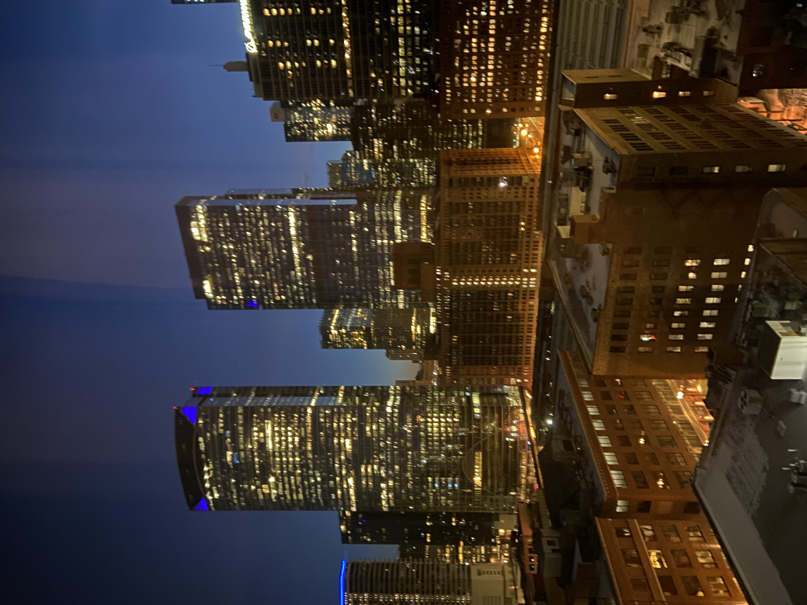

# UIUCTF 2023 Finding Jonah? Writeup

## 题目简述

题目要求结合 Explorer 系列前几题的线索和一张芝加哥夜景，找出 Jonah 入住的酒店。此前已知他在 West Loop 活动，并得到 ZIP Code `60661`。



## 解题过程

照片右上角能辨认出 Boeing 标识。比赛时的 Boeing International Headquarters 位于 `100 North Riverside Plaza`，在芝加哥河西岸，是非常强的定向地标。

以该建筑为锚点，在地图上筛选其西侧、位于 West Loop 且邮编为 `60661` 的高层酒店，再比较楼层高度和向东的城市景观，可以锁定 `116 N Jefferson St` 的酒店建筑。该楼是双品牌项目：

- Hampton Inn Chicago Downtown West Loop，现也称 Hampton Inn Chicago West Loop Fulton Market Area；
- Homewood Suites by Hilton Chicago Downtown West Loop。

酒店高层房间朝东时，Boeing Building 会出现在画面右侧，位置关系与题图相符；地址的五位邮编也正是上一题解出的 `60661`。酒店名称与地址还可在 [Hilton 官方 Hampton 页面](https://www.hilton.com/en/hotels/chiwxhx-hampton-chicago-downtown-west-loop/) 核对。

题目后端同时接受母品牌 `Hilton` 和更具体的 `Hampton Inn`，使用具体品牌可提交：

```text
uiuctf{hampton_inn}
```

## 方法总结

城市景观定位应把可识别招牌当作锚点，再利用左右方位、遮挡关系、拍摄高度和已有区域信息反推相机位置。本题还可用前一题的 ZIP Code 形成独立交叉验证。需要注意双品牌酒店：同一建筑可能同时对应 Hampton 和 Homewood Suites，记录完整地址比只记录集团名更可靠。
