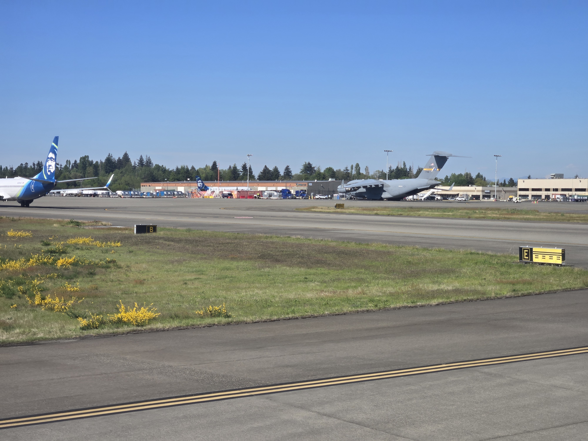

# Chunky Boi

## 题目简述

附件拍到一架大型军用运输机，要求提交机型和飞机所在坐标，坐标保留三位小数但直接截断而不四舍五入。照片没有 GPS，需要把机体识别、EXIF 时间、ADS-B 历史轨迹和机场滑行道布局串成证据链。

## 解题过程



机体具有高置后掠翼、四台翼下发动机、T 形尾翼和肥大的战略运输机机身，外形对应 Boeing C-17 Globemaster III。进一步读取尾号关联记录，可得到注册号 `07-7182` 和 Mode-S 十六进制地址 `AE20C3`；公开 ADS-B 记录也把该地址标为军用 `C17`。

原图 EXIF 中没有 GPS，但保留了拍摄时间 `2024-05-11 16:44:28`。在 [ADS-B Exchange 的 AE20C3 记录](https://globe.adsbexchange.com/?icao=ae20c3) 中选择 2024-05-11 的历史轨迹，可以确认该机当天进入 Seattle-Tacoma International Airport（SEA）。背景中大量 Alaska Airlines 飞机与其维护设施也与该机场相符，但只能作为辅助证据。

最后用机场平面图解决“机场内哪一点”的问题。照片前景能读出滑行道 `B`、`E` 以及通往 `B/C` 的方向信息；[FAA 的 SEA 机场图](https://aeronav.faa.gov/d-tpp/2508/00582ad.pdf) 显示这些滑行道与货运坪的相对关系。结合飞机右侧建筑、Alaska 设施和拍摄方向，C-17 位于 Cargo Ramp，对应位置约为北纬 47.462、西经 122.303。按题目指定的名称和截断精度提交：

```text
uiuctf{Boeing C-17 Globemaster III, 47.462, -122.303}
```

## 方法总结

- 先用机体结构和可见尾号确定机型与唯一飞机，再用 EXIF 日期筛选 ADS-B 历史轨迹，不能仅凭背景航空公司猜机场。
- ADS-B 只能把目标定位到机场附近；滑行道字母、方向牌、机库和货运区布局负责完成机场内的精定位。
- 题目明确要求截断坐标，最终格式校验和 OSINT 证据同样重要。原图保留了机体、标牌与空间关系，因而以语义化名称归档。
