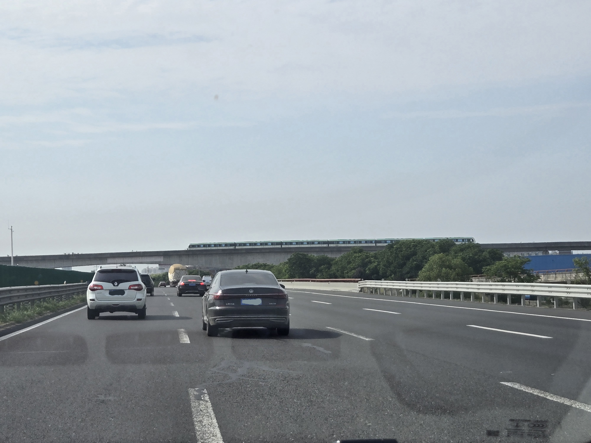

# New Dallas

## 题目简述

附件显示一列绿色涂装列车从宽阔高速公路上方通过，要求提交铁路与公路交叉点的坐标。坐标必须保留三位小数并直接截断。决定性线索来自车辆制式、车牌属地、轨道是否高架以及道路尺度的交叉验证。

## 解题过程



中国高速铁路列车通常是白色车体配彩色条纹，图中短编组、密集车门和绿色腰线更符合城市地铁。车辆使用中国蓝色车牌，其中可辨属地线索指向山西与江苏苏州；山西车辆可视为外地车，而苏州及邻近城市更值得检查。

苏州的绿色线路主要位于地下，列车外观也不吻合。相邻的无锡地铁使用图中这类绿色涂装，且大量区段位于高架，因此城市可收敛到无锡。接下来在地图上筛选能容纳双向八车道、带连续路肩，并与高架地铁正交的道路。无锡范围内符合尺度的主要候选是 G2 京沪高速。

沿 G2 检查与无锡地铁线路的交点，2 号线在无锡宜家附近跨越 G2 的位置同时匹配照片中的高架方向、道路宽度、树木和周边大型商业建筑。地图坐标截断到三位小数为：

```text
uiuctf{31.579, 120.388}
```

## 方法总结

- 先区分高铁与地铁，再用列车涂装和高架比例识别城市；单独依赖一辆外地车的省份会产生错误方向。
- 公路定位应把车道数、路肩、轨道交角和邻近地标同时作为过滤条件，最终在地图/街景中复核视角。
- 原图中的列车、车牌制式和道路几何都是决定性视觉证据，不能用几句文字完全替代，因此保留并采用语义化文件名与详细说明。
