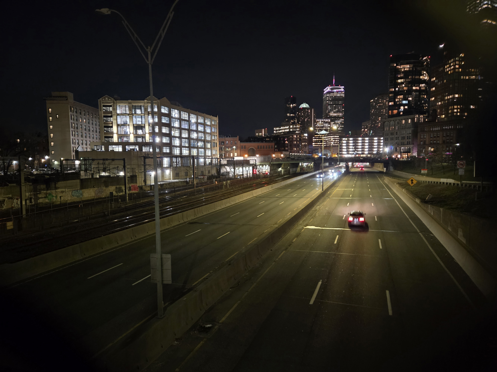

# Night

## 题目简述

附件是一张夜间城市景观，要求定位拍摄所在街道与城市，格式为 `uiuctf{street name, city name}`。题目模糊了可直接识别的文字，因此需要依靠天际线、公路与铁路布局以及拍摄视角完成地理定位。

## 解题过程



画面中最稳定的地标是远处顶部呈阶梯状、带彩色灯光和天线的 Prudential Tower；其旁边的圆顶建筑与周围高楼组合也符合波士顿 Back Bay 天际线。前景则是一条位于城市切槽中的多车道高速公路，左侧紧贴多股铁路。

Prudential Tower 与高速公路的组合把道路锁定为 Massachusetts Turnpike，即 I-90。沿 I-90 在 Back Bay 一带检查跨线桥：候选位置既要能同时俯视南侧公路和北侧铁路，又要让 Prudential Tower 位于画面纵深中央，并匹配道路弯曲、右侧建筑及左侧轨道设施的相对位置。

对照地图和街景后，Arlington Street 跨越 I-90 与铁路走廊的位置满足这些约束，拍摄方向朝西。按题目要求使用完整道路类型并保留逗号后的空格，答案为：

```text
uiuctf{Arlington Street, Boston}
```

## 方法总结

- 城市夜景定位应先找轮廓稳定的地标，再用道路类型、铁路数量和相对方位缩小范围；灯牌文字不是唯一线索。
- 最终街道不能只凭“看起来在 Boston”猜测，应逐个核对跨线桥视角、地标方位、道路弯曲和邻近建筑。
- 原图直接承载天际线与空间关系，具有不可替代的视觉证据价值，因此以语义化文件名保留，并在图片说明中明确指出可复核线索。
