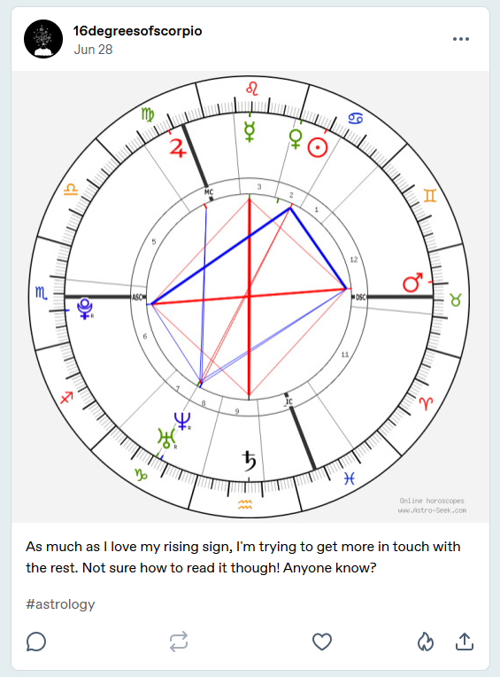
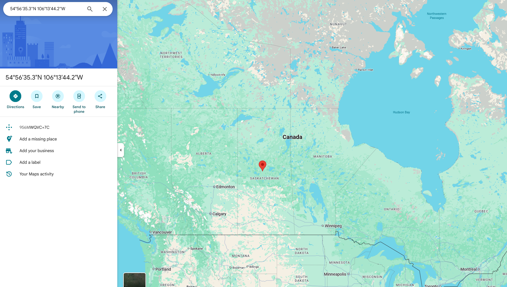

# Age of Aquarius

## 题目简述

题目要求继续调查 `Bad Blood` 中找到的 `@16degreesofscorpio.bsky.social`，确定其生日聚会所在的国家及省/州。目标没有直接公开地点，而是泄漏了出生日期、星盘和上升星座；把这些占星参数反向映射到出生坐标，才是本题的决定性步骤。

## 解题过程

Bluesky 主页链接到 Tumblr 账号 `16degreesofscorpio`。其中一条问答说明，生日聚会将在本人出生和长大的地区附近举办，因此题目实际要恢复的是出生地。

接着整理 Tumblr 帖子中的时间线：

- 6 月 28 日的问答表示生日在“下个月”，因此生日在 7 月；
- 7 月 22 日的帖子说，最喜欢的卫星在“一周前”迎来 21 岁生日，而且该日期比本人生日早 3 天；
- 该描述对应 2004 年 7 月 15 日发射的 Aura 地球观测卫星，因此目标生日为 7 月 18 日；
- 账号名和另一条帖子给出上升星座为天蝎座 $16^\circ$。

目标随后公开了一张出生星盘。与纯文字 Tumblr 截图不同，星体和宫位的空间位置必须从图上读取，因此保留原图作为证据：



按照官方解答，将星盘整理为以下参数：

```text
Sun: Cancer 21°
Moon: Capricorn 0°
Saturn: Aquarius 16°
Ascendant: Scorpio 16°
Midheaven: Virgo 7°
House system: Placidus
```

把这些值输入 [Astro-Seek 的 Reverse Engineering Chart](https://horoscopes.astro-seek.com/calculate-reverse-engineering-chart)，允许度数存在少量读图误差，结果会收敛到坐标约 `54°56'35.3"N 106°13'44.2"W`。地图显示该点位于加拿大 Saskatchewan（萨斯喀彻温省）中部：



题目接受大小写变化，标准写法为：

```text
uiuctf{Canada, Saskatchewan}
```

## 方法总结

- 核心技巧：把社交账号、帖子日期和星盘参数拼成一条证据链，再使用反向星盘工具恢复出生坐标。
- 识别信号：生日、出生时间、出生地点与完整星盘并非相互独立；公开足够多的星体、上升点和中天位置后，地点具有可逆性。
- 复用要点：先用帖子时间线锁定日期，再读星盘中的太阳、月亮、土星、上升与中天；工具链接只是计算载体，输入参数、容差和最终坐标必须写入正文。
