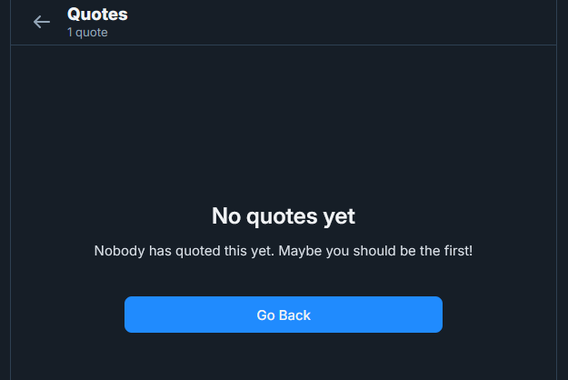

# Bad Blood

## 题目简述

题目沿用 `Mr. Blue Sky` 的账号，提示有人与他发生过互动，但目标用户试图隐藏这段关系。决定性线索是 Bluesky 的 detached quote：引用者可以从原帖上分离引用，前端不再展示账号，底层 AT Protocol 接口却仍可能返回引用记录。

## 解题过程

检查 Mr. Blue Sky 的帖子及引用页时，会遇到一个不一致状态：页面顶部显示存在 `1 quote`，正文却显示 `No quotes yet`。



这说明引用计数没有随前端列表一起消失。打开浏览器网络面板可以发现，引用页调用的是公开的 `app.bsky.feed.getQuotes` 接口。无需保留网络面板截图，直接复现该请求即可：

```bash
curl 'https://public.api.bsky.app/xrpc/app.bsky.feed.getQuotes?uri=at%3A%2F%2Fdid%3Aplc%3Axjatwbtmfpm4ja52xcxnfwcd%2Fapp.bsky.feed.post%2F3lspmsdtlvs2k&limit=30'
```

返回对象中仍能看到引用者的身份及已分离记录，例如关键字段可整理为：

```json
{
  "author": {
    "handle": "16degreesofscorpio.bsky.social"
  },
  "embed": {
    "record": {
      "$type": "app.bsky.embed.record#viewDetached",
      "detached": true
    }
  }
}
```

因此下一跳是 `@16degreesofscorpio.bsky.social`。其帖子本身已被作者移除，但 `Feeds` 标签下的订阅源 `Scorpios Only!` 仍在简介中留下：

```text
uiuctf{bU7_1m_4_c4pr1c0rn_7098743}
```

官方解答也指出，全局搜索会索引 Feed 的描述，直接搜索 `uiuctf` 并切换到 Feeds 结果可意外绕过上述取证过程。

## 方法总结

- 核心技巧：从“计数非零、前端列表为空”的差异出发，直接查询前端使用的公开 API，恢复被界面隐藏的引用者。
- 识别信号：删除、隐藏或分离内容后，聚合计数、嵌入对象、通知与 API 响应可能没有同步清除。
- 复用要点：不要把 UI 的“不可见”等同于底层对象不存在；应记录资源 URI、接口名和关键响应字段，才能让社交平台取证链可复现。
