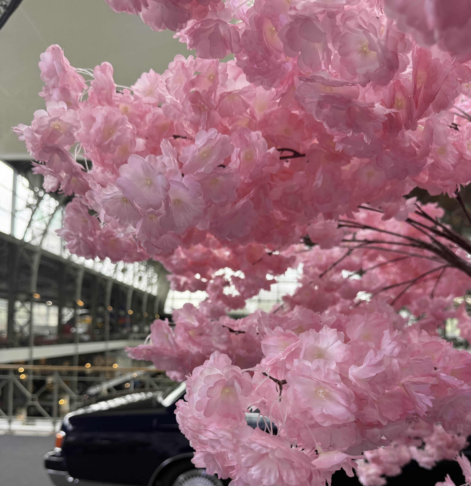

# cherry_blossom

## 题目简述

题目给出一张室内“樱花”照片，要求提交拍摄建筑在 Google Maps 上显示的地址。图中没有文字标牌，关键是先判断樱花为展陈道具，再利用玻璃钢结构、夹层和车辆展品识别场馆。

## 解题过程



花瓣形状高度重复，枝条间还能看到固定线和透明支撑，说明这并不是生长在温室里的真实樱树，而是一组室内人造装置。定位时应弱化占据画面大部分的粉色花朵，重点裁取背景：

- 高挑的金属桁架与玻璃屋顶；
- 沿墙布置的双层回廊和栏杆；
- 下方可见的汽车外形；
- 临时大型装饰物与常设车辆展览共存。

对这些建筑结构做反向图像搜索，会出现 Brussels（布鲁塞尔）的 Autoworld 汽车博物馆及其活动照片。将候选场馆的室内照片与原图比较，桁架跨度、夹层栏杆和车辆展区均能对齐；原图中的樱花则是馆内阶段性展陈，而不是地理环境本身。

最后查询 Autoworld 在 Google Maps 上的罗马字地址，得到：

```text
Parc du Cinquantenaire 11, 1000 Bruxelles, Belgium
```

因此标准 flag 为：

```text
uiuctf{Parc du Cinquantenaire 11, 1000 Bruxelles, Belgium}
```

仓库没有为本题提供官方文字解答；上述“人造花判断—场馆结构检索—地图地址确认”路径与 [公开参赛者题解](https://enoch.host/archives/uiuctf-2025-wp) 交叉核对，并以 `challenge.yml` 中列出的多种可接受地址确认。

## 方法总结

- 核心技巧：把显眼但不稳定的活动装饰与稳定的建筑结构分开，使用后者定位场馆。
- 识别信号：室内植物形态异常重复、存在支撑线，同时背景出现大型公共展馆和专业展品，往往说明目标是场馆而非植物产地。
- 复用要点：图像搜索得到场馆名后，还要用室内结构进行二次比对；题目要求地址时，应按指定地图服务的显示格式提交，而不是自行翻译城市或国家名。
