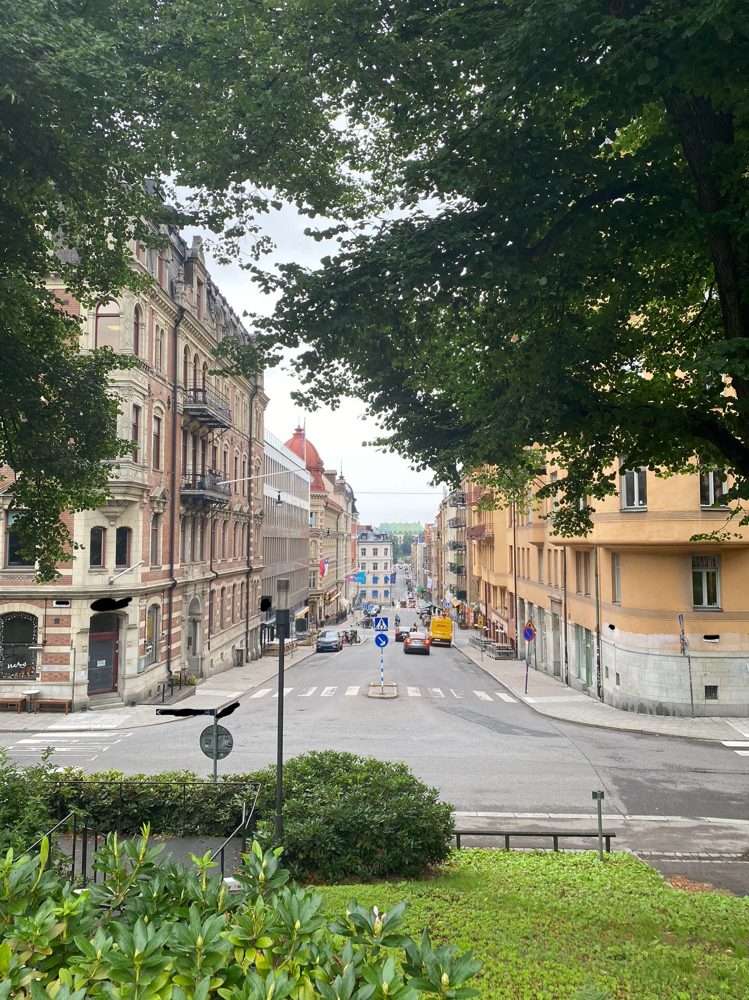

# park

## 题目简述

题目只给出一张从公园边缘拍摄的街景，要求提交该公园在 Google Maps 上的名称。图片没有可直接读取的公园牌，必须利用道路设施、建筑风格、地形和背景建筑逐步缩小范围。

## 解题过程



先观察国家级线索：蓝底三角形人行横道牌、路侧标线杆的蓝黄色彩、车辆与道路方向，以及密集的北欧城市建筑，都指向瑞典。街道两侧历史主义立面、狭窄街网和明显坡度则更符合 Stockholm（斯德哥尔摩）中心城区。

由于近处招牌被遮挡，搜索时不要只截取树木，而应分别使用远处绿顶建筑、左侧砖石立面和完整街道透视做图像检索。公开参赛者题解记录的有效方法也是对背景建筑做反向搜索，再回到地图核对周边公园。候选落到 Stockholm 后，在地图照片与街景中比较以下几项：

- 取景点位于一块高于路面的公园绿地；
- 公园边缘正对一条向下延伸的城市街道；
- 两侧建筑的开窗、阳台、屋顶轮廓与照片一致；
- 远处街口和道路设施的相对位置能够同时对齐。

这些条件共同匹配 `Tegnérlunden`。题目配置同时接受去掉重音符号的 `Tegnerlunden`，标准 flag 为：

```text
uiuctf{Tegnérlunden}
```

仓库没有为本题提供官方文字解答；以上定位链与 [公开参赛者题解](https://enoch.host/archives/uiuctf-2025-wp) 的结论交叉核对，并以仓库 `challenge.yml` 中的接受答案确认。

## 方法总结

- 核心技巧：先用道路设施确定国家，再用建筑、坡度和街道透视做区域级反向图像搜索，最后以地图几何逐项验证。
- 识别信号：地理题刻意遮住文字时，远处建筑轮廓和多个固定物体之间的相对位置通常比植被、天气更稳定。
- 复用要点：反向搜索结果只能生成候选，不能单独构成结论；至少应再核对取景高度、道路方向、建筑立面和街口布局。
