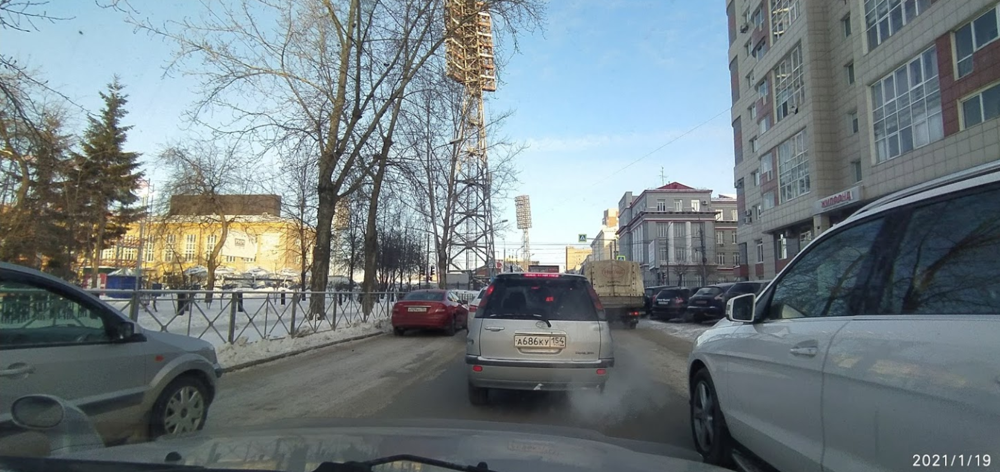

# Justin 2

## 题目简述

题目图片拍摄于俄罗斯城市道路。可见线索包括西里尔文字、车牌地区码和远处的体育建筑，需要先确定城市，再用街景/地图匹配具体道路。



## 解题过程

放大车辆号牌可读到类似：

```text
A686KY 154
```

俄罗斯车牌末尾 `154` 是新西伯利亚州地区码，因此先把搜索范围缩到 Novosibirsk。再裁剪远处塔状建筑和道路轮廓，结合俄文地图与街景匹配，可确定建筑为 Spartak Stadium 一带。

沿体育场周边道路对比视角、车道方向和建筑相对位置，拍摄道路为：

```text
Ulitsa Kamenskaya
```

提交：

```text
UMDCTF-{Ulitsa_Kamenskaya}
```

## 方法总结

地理定位应从高置信度的行政线索逐步缩小：车牌地区码确定区域，独特建筑确定街区，最后用道路几何和视角确定街名。仅凭西里尔文字不能区分城市，单独依赖模糊建筑轮廓也容易命中相似地点。
