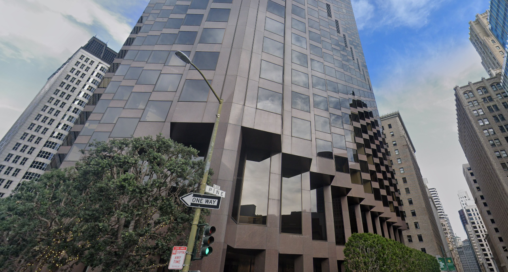

# Traveling

## 题目简述

题目给出一张美国城市街景。画面中可辨认 `Pine St` 路牌和一座造型显著的高层建筑，需要确定建筑名称或门牌地址。



## 解题过程

先读取路牌，将搜索范围限定到存在 Pine Street 的候选城市；再比较背景建筑的立面、顶层轮廓和街道夹角。画面对应旧金山金融区，建筑是：

```text
555 California Street Building
```

道路视角和周边街区可以在地图/街景中相互验证。按题目接受的名称提交：

```text
UMDCTF-{555 California Street Building}
```

## 方法总结

城市街景定位应同时利用文字和建筑几何。常见道路名可能跨多个城市重复，只有把路牌、天际线、路口方向和建筑轮廓结合，才能排除误命中。图片保留了这些视觉关系，因此不应转成纯文本后删除。
